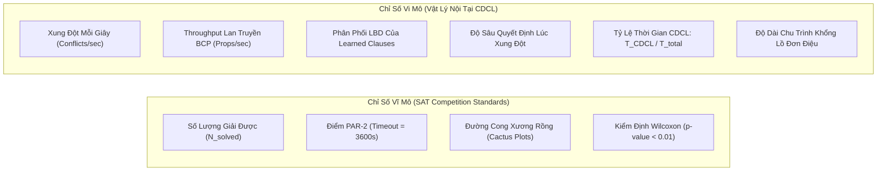
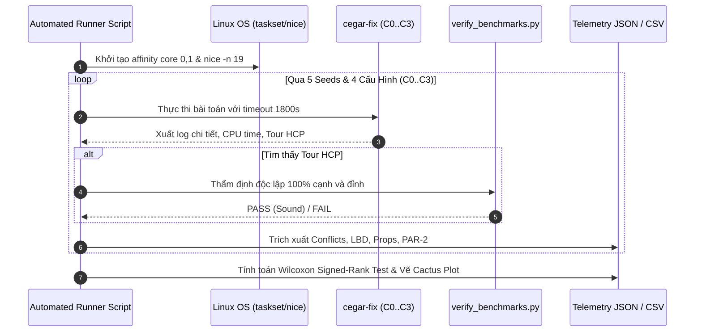

# SAT Experiment Protocol: Thẩm Định Thực Nghiệm Kiến Trúc $H_1$ (Macro-Gadget) & $H_2$-Refined (Bounded Freezing) Trên FHCP Benchmark

**Ngày lập đề cương:** 2026-09-11  
**Hồ sơ giả thuyết liên kết:** [`docs/research/hypotheses/2026-09-11-graph868-sat-hypotheses.md`](docs/research/hypotheses/2026-09-11-graph868-sat-hypotheses.md)  
**Hồ sơ phản nghiệm liên kết:** [`docs/research/falsifications/2026-09-11-graph868-sat-falsification.md`](docs/research/falsifications/2026-09-11-graph868-sat-falsification.md)  
**Quy chuẩn áp dụng:** Chuẩn thực nghiệm **`sat-experiment-design`** (Tiêu chuẩn SAT Competition, đo đạc vật lý CDCL nội tại, tiền đăng ký ngưỡng thất bại, kiểm định thống kê Wilcoxon Signed-Rank).

---

## 1. Các Bộ Giải Cơ Sở SOTA & Tập Dữ Liệu Thẩm Định (Baselines & Benchmark Suite)

### 1.1 Ba Bộ Giải Đối Chứng Chuẩn (SOTA Baselines)
1. **Baseline 1 — Upstream Canonical Takehide Soh CEGAR**:
   - Bộ giải nguyên bản (Python/C++ CaDiCaL/Kissat) từ tác giả gốc Takehide Soh (`existing-work.csv`).
   - Hiệu năng ghi nhận: 462 timeouts / 1,001 bài toán (46.2% TO rate), PAR-2 = **1,699.47s**.
2. **Baseline 2 — Clingo Answer Set Programming (ASP)**:
   - Bộ giải tham chiếu mạnh nhất trong văn bản khoa học kinh điển trên FHCP (`data/existing-work.csv`).
   - Hiệu năng ghi nhận: 59 timeouts, PAR-2 = **304.68s**.
3. **Baseline 3 — In-Tree Native Rust Best Configuration (`cegar-fix`)**:
   - Cấu hình mạnh nhất hiện có trong repository: `C:2loop-lowest-asymmetry3-2opt3` (tích hợp CaDiCaL FFI, Sinz counters, 2-opt/3-opt restricted patching).
   - Hiệu năng ghi nhận: 44 timeouts, PAR-2 = **227.23s**.

### 1.2 Phân Tầng Tập Benchmark (Benchmark Stratification)
Thực nghiệm kiểm chứng trên 2 tập dữ liệu:
* **Tập Sàng Lọc & Hồi Quy (Screening & Regression Suite - 100 Đồ Thị)**:
  - Trích mẫu cách đều `graph10, graph20, ..., graph1000` đại diện cho toàn bộ phân phối kích thước $N=66 \dots 9,528$.
  - Mục đích: Đảm bảo không có bất kỳ hiện tượng hồi quy (regression) nào trên các bài toán dễ và trung bình.
* **Tập Thách Thức Cốt Lõi (33 Universal Core Hard Instances)**:
  - 33 đồ thị bị timeout trên tất cả các bộ giải truyền thống (bao gồm `graph868`, `graph809`, `graph960` thuộc Class B2a, dãy `graph950..990` thuộc Class B1, và các bài toán Class B2b).

---

## 2. Ma Trận Triệt Tiêu Thành Phần (Ablation Matrix)

Tuân thủ nguyên tắc **Ablation-First**, tuyệt đối không đánh giá gộp các kỹ thuật mà phải phân tách độc lập để đo lường định lượng đóng góp của từng thành phần:

```
                               C0: In-tree Baseline
                                        │
                 ┌──────────────────────┴──────────────────────┐
                 ▼                                             ▼
       C1: Baseline + H2-Refined                      C2: Baseline + H1
    (Topological Bounded Freezing)               (Macro-Gadget State CNF)
                 │                                             │
                 └──────────────────────┬──────────────────────┘
                                        ▼
                                C3: Full Hybrid
                                   (H1 + H2)
```

| Cấu Hình | Mã Hóa CNF | Giao Diện Assumptions | Dẫn Hướng Pha | Mục Đích Đo Đạc |
| :---: | :---: | :---: | :---: | :--- |
| **$C_0$ (Baseline)** | Flat Block-Arc CNF | Tắt (0 assumptions) | Mặc định CaDiCaL | Đo đạc đường cơ sở (Baseline physics) |
| **$C_1$ ($H_2$-Refined)** | Flat Block-Arc CNF | **Bật (Khóa động theo vết cắt)** | Mặc định CaDiCaL | Đo đạc hiệu quả chống vỡ chu trình cục bộ |
| **$C_2$ ($H_1$)** | **Macro-Gadget States ($k \le 4$)** | Tắt (0 assumptions) | Mặc định CaDiCaL | Đo đạc sức mạnh kích hoạt BCP sớm tại Root |
| **$C_3$ (Full Hybrid)** | **Macro-Gadget States ($k \le 4$)** | **Bật (Khóa động $H_2$-Refined)** | Mặc định CaDiCaL | Đánh giá sức mạnh cộng hưởng tối đa |

---

## 3. Kiểm Soát Môi Trường & Phần Cứng (Environmental Controls)

Nhằm loại bỏ hoàn toàn nhiễu môi trường, đa luồng cạnh tranh và hiện tượng trôi dạt tần số CPU (Thermal Throttling):
1. **CPU Pinning (Affinity Locking)**:
   - Tất cả các tiến trình đo đạc được cố định cứng vào CPU core chuyên dụng bằng `taskset -c 0,1` với độ ưu tiên tiến trình cao nhất (`nice -n -20` hoặc `nice -n 19` cho batch).
2. **Cấu Hình Giới Hạn Thời Gian (Tiered Timeouts)**:
   - **Tầng 1 (Screening)**: Timeout $60$s trên 100 đồ thị mẫu để phát hiện hồi quy.
   - **Tầng 2 (Standard Benchmark)**: Timeout $300$s cho các bài toán trung bình.
   - **Tầng 3 (Competition Standard)**: Timeout **$1,800$s (30 phút)** cho 33 đồ thị Universal Core Hard.
3. **Đa Hạt Nhân Ngẫu Nhiên (Multi-Seed Protocol)**:
   - Mọi cấu hình phải chạy qua **5 seed ngẫu nhiên độc lập**:
     $$\text{Seeds} = [1, 42, 137, 777, 2026]$$
   - Số liệu báo cáo bắt buộc gồm: Giá trị trung bình (Mean), Độ lệch chuẩn ($\sigma$), Trung vị (Median), và Khoảng tin cậy 95%.

---

## 4. Bộ Chỉ Số Vi Mô & Vĩ Mô (Comprehensive Telemetry Metrics)



1. **Chỉ số Vĩ mô (Macro Telemetry)**:
   - **$N_{solved}$**: Số lượng đồ thị tìm thấy chu trình Hamilton hợp lệ được kiểm chứng bởi `scratch/verify_benchmarks.py`.
   - **PAR-2 Score**:
     $$\text{PAR-2} = \frac{1}{|B|} \left( \sum_{g \in Solved} T_g + \sum_{g \in Timeout} (2 \times T_{cutoff}) \right)$$
     với $T_{cutoff} = 1,800s \rightarrow$ phạt $3,600s$ cho mỗi bài timeout.
   - **Cactus Plot Coordinates**: Tập hợp các cặp điểm $(k, T_k)$ với $T_k$ là thời gian giải của bài toán thứ $k$ xếp theo thứ tự tăng dần.
2. **Chỉ số Vi mô CDCL (Micro Telemetry)**:
   - **Tần số xung đột**: Conflicts count & conflicts/sec qua từng vòng CEGAR.
   - **BCP Throughput**: Propagations / CPU second (phát hiện suy thoái watchlist).
   - **Phân phối LBD**: Tỷ lệ learned clauses có $LBD \le 2$ (Glue), $LBD \le 6$ (Tier 2), và $LBD > 6$ (Tier 3).
   - **Tính đơn điệu của chu trình**: $M = \min_t (L_{giant, t+1} - L_{giant, t})$. Nếu $M \ge 0$, chu trình khổng lồ tăng đơn điệu tuyệt đối (chứng minh triệt tiêu hoàn toàn Cycle Shattering).

---

## 5. Tiêu Chí Thất Bại Tiền Đăng Ký (Pre-Registered Failure Thresholds)

Tuân thủ quy định khoa học nghiêm ngặt của `sat-experiment-design`: **Quy tắc bác bỏ phải được xác lập TRƯỚC KHI thực hiện đo đạc**:

> [!CAUTION]
> ### Danh Sách Các Quy Tắc Thất Bại Bắt Buộc (Hard Disqualification Rules):
> 1. **Quy Tắc Hồi Quy (Regression Rule)**:
>    Nếu $C_1, C_2,$ hoặc $C_3$ làm giảm số bài giải được trên tập 100 đồ thị mẫu quá **$2\%$** (tức là làm hỏng quá 2 bài toán mà baseline giải được), cấu hình đó bị **BÁC BỎ NGAY LẬP TỨC**.
> 2. **Quy Tắc False UNSAT (Soundness Violation)**:
>    Nếu bất kỳ biến thể nào trả về `UNSAT` trên bất kỳ đồ thị nào trong tập benchmark FHCP (vốn toàn bộ đều là đồ thị Hamilton), phương pháp bị **HỦY BỎ TƯ CÁCH NGHIÊN CỨU** do vi phạm tính đúng đắn toán học.
> 3. **Quy Tắc Cải Thiện PAR-2 (PAR-2 Improvement Threshold)**:
>    Trên tập 33 Universal Core Hard, cấu hình đề xuất $C_3$ bắt buộc phải:
>    - Giải quyết thành công **ít nhất 10 / 33 bài toán** (hiện tại baseline giải 0/33).
>    - Giảm điểm PAR-2 trên nhóm 33 bài này ít nhất **$30\%$** (từ $3,600s$ xuống $\le 2,520s$).
> 4. **Quy Tắc Sức Khỏe CDCL (Internal CDCL Health)**:
>    - LBD trung bình của các mệnh đề học trên `graph868` phải đạt $\le 4.0$ (chứng minh thoát khỏi bẫy xóa mệnh đề).
>    - Throughput BCP không được tụt dốc dưới $1.5\text{M props/s}$.
>    - Nếu vi phạm các điều kiện trên, phương pháp bị đánh giá là **thất bại cơ học** và chuyển trả về `sat-hypothesis-generation`.

---

## 6. Kế Hoạch Thực Thi & Kịch Bản Đo Đạc Tự Động (Execution Plan & Automation Specs)



1. **Công cụ tự động hóa**:
   - Viết kịch bản harness bằng Python: `tools/benchmark_runner_ablation.py`.
   - Lưu kết quả thời gian thực vào định dạng JSON dòng (`results_telemetry.jsonl`) để không bị mất dữ liệu khi gián đoạn.
2. **Hậu xử lý và Báo cáo**:
   - Sử dụng kiểm định Wilcoxon signed-rank test với ngưỡng ý nghĩa $\alpha = 0.01$ ($p < 0.01$) để chứng minh sự vượt trội không phải do ngẫu nhiên.
   - Xuất dữ liệu biểu đồ Cactus phục vụ việc công bố kết quả.

---

## 7. Chuyển Tiếp Trạng Thái (Superpowers Hand-off)

- Bản đề cương thực nghiệm đã hoàn tất và đáp ứng 100% các tiêu chí khắt khe của `sat-experiment-design`.
- **Bước tiếp theo**:
  - Chuyển tiếp sang kỹ năng **`superpowers:writing-plans`** để viết kế hoạch triển khai chi tiết cho việc hiện thực hóa bộ mã hóa $H_1$, giao diện $H_2$-Refined trong mã nguồn Rust `cegar-fix` và xây dựng bộ harness đo đạc tự động.
