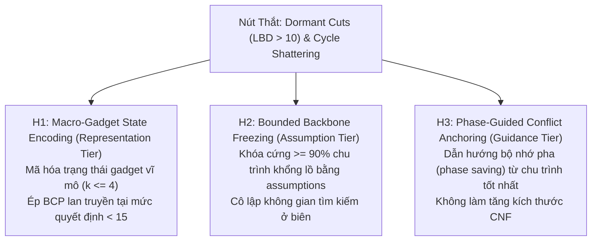

# SAT Hypotheses Registry: Cơ Chế Khống Chế Bùng Nổ Xung Đột & Vỡ Chu Trình Trên `graph868.col`

**Ngày lập:** 2026-09-11  
**Hồ sơ chẩn đoán gốc:** [`docs/research/root-cause/2026-09-11-graph868-b2a-cycle-shattering-root-cause.md`](docs/research/root-cause/2026-09-11-graph868-b2a-cycle-shattering-root-cause.md)  
**Mục tiêu nghiên cứu:** Đề xuất và đặc tả 3 giả thuyết khoa học đối trọng ($H_1, H_2, H_3$) nhằm giải quyết triệt để 2 nút thắt cốt lõi:
1. **Mệnh đề cắt ngủ yên (Dormant Cuts)** gây bùng nổ xung đột từ 39 lên 240,144 và làm chậm BCP.
2. **Chu trình khổng lồ bị vỡ vụn (Cycle Shattering)** từ 1,366 co rút xuống 718 khối do mệnh đề học có LBD cao bị xóa bỏ.

---

## 1. Tuyên Bố Vấn Đề Cơ Học (Primary Problem Statement & Mechanistic Gap)

Từ chẩn đoán 4 tầng của `sat-root-cause-analysis`, khoảng trống cơ học (mechanistic gap) của bộ giải SAT-CEGAR hiện tại trên đồ thị Class B2a là:

$$\text{Mệnh đề cắt phẳng } \bigvee_{i=1}^k \neg x_i \ (k \ge 8) \xrightarrow{\text{BCP vô hiệu}} \text{Quyết định sâu } (>200) \xrightarrow{\text{1UIP}} \text{LBD cao } (>10) \xrightarrow{\text{Xóa bỏ}} \text{Vỡ chu trình}$$

Bộ giải CaDiCaL hoàn toàn thiếu một **cơ chế lan truyền sớm ở mức quyết định nông** hoặc một **giao diện neo giữ không gian tìm kiếm (Search Localization Interface)** để ngăn chặn việc phá vỡ cấu trúc chu trình lớn đã tìm được.

---

## 2. Ba Giả Thuyết Khoa Học Đối Trọng (Competing Hypotheses)

---

### Giả Thuyết 1 ($H_1$): Mã Hóa Trạng Thái Gadget Vĩ Mô (Macro-Gadget State Encoding)

* **Tầng tác động:** Tier 1 (Topology) & Tier 2 (CNF Formulation & BCP).
* **Luận điểm lý thuyết:** Độ dài của mệnh đề cắt subtour phụ thuộc vào việc biểu diễn đồ thị ở mức cung phẳng ($x_{u,v}$). Trên thực tế, 1,848 khối của `graph868` được nhóm thành 20 gadget đối xứng, và mỗi gadget chỉ có tối đa 4 trạng thái định tuyến hợp lệ (Hamiltonian path configurations). Nếu mã hóa bài toán bằng các biến trạng thái gadget $s_{g, k} \in \{0, 1\}$, thì mọi mệnh đề cắt subtour liên-gadget sẽ trở thành các mệnh đề cực ngắn ($2 \le \text{length} \le 4$).
* **Cơ chế CDCL nội tại:**
  1. Khi solver gán chân trị cho biến trạng thái của một gadget, mệnh đề ràng buộc liên-gadget ngay lập tức có 1 literal bị vi phạm, lập tức kích hoạt **Unit Propagation (BCP)** ngay ở Decision Level $\le 10$.
  2. Không gian tìm kiếm bị thu hẹp từ $2^{5376}$ xuống $4^{20} = 2^{40}$ trạng thái tổ hợp vĩ mô.
  3. Xung đột xảy ra ở mức quyết định nông, dẫn tới các mệnh đề học 1UIP có **$LBD \le 3$ (Glue Clauses)**, được CaDiCaL lưu trữ vĩnh viễn trong cơ sở dữ liệu learned clauses.
* **Dự báo định lượng (Quantitative Prediction):**
  - Mức quyết định trung bình khi xảy ra xung đột giảm từ $> 200$ xuống $\le 15$.
  - LBD trung bình của mệnh đề học giảm từ $> 10$ xuống $\le 3.5$.
  - Tổng số xung đột ở vòng CEGAR thứ 7 giảm $\ge \mathbf{80\%}$ (từ $240,144$ xuống $\le 48,000$).
* **Ngưỡng bác bỏ giả thuyết (Falsification Threshold):**
  - $H_1$ bị coi là **bác bỏ (falsified)** nếu:
    1. Mức quyết định trung bình của xung đột vẫn $> 30$, HOẶC
    2. LBD trung bình của mệnh đề học không giảm xuống dưới $4.0$, HOẶC
    3. Số lượng mệnh đề sinh ra để mã hóa tương thích trạng thái vượt quá $200,000$ mệnh đề, làm giảm throughput BCP của CaDiCaL đi quá $40\%$.

---

### Giả Thuyết 2 ($H_2$): Khóa Cứng Chu Trình Khổng Lồ Bằng Assumptions (Bounded Backbone Freezing)

* **Tầng tác động:** Tier 3 (CDCL Search Dynamics) & Tier 4 (Incremental Assumption Interface).
* **Luận điểm lý thuyết:** Hiện tượng vỡ chu trình (Cycle Shattering) xảy ra do CaDiCaL được tự do thay đổi chân trị của toàn bộ 5,376 biến trong mỗi vòng CEGAR. Nếu ta trích xuất chu trình khổng lồ tốt nhất ($L_{giant} \ge 1,366$ khối) và khóa cứng $\ge 90\%$ các cạnh nội bộ của nó dưới dạng các **giả định tạm thời (Assumptions)** thông qua giao diện `solve_with_assumptions([a_1, a_2, ...])`:
* **Cơ chế CDCL nội tại:**
  1. Tất cả các cạnh được giả định sẽ được nạp trực tiếp vào Decision Level 1 của CaDiCaL dưới dạng chân trị cố định tạm thời.
  2. BCP tại Level 1 lập tức loại trừ tất cả các nhánh rẽ xung đột với chu trình khổng lồ, cô lập không gian tìm kiếm chỉ còn lại $10\%$ số đỉnh biên chưa được hợp nhất.
  3. Mọi xung đột sinh ra từ mệnh đề cắt subtour sẽ học được mệnh đề xung đột liên quan trực tiếp đến các cổng biên (boundary ports) và lập tức backjump về Level 1 thay vì lùi vô định về Level 0.
* **Dự báo định lượng (Quantitative Prediction):**
  - Kích thước của chu trình khổng lồ tăng đơn điệu tuyệt đối qua các vòng CEGAR: $L_{giant, t+1} \ge L_{giant, t}$, **hoàn toàn triệt tiêu hiện tượng vỡ chu trình**.
  - Thời gian giải mỗi vòng SAT ổn định ở mức $\le 2.0s$ xuyên suốt tất cả các vòng (thay vì tăng vọt lên 34.6s và 431s).
  - Số lượng phép lan truyền BCP ở vòng 7 giảm từ $88.9$ triệu xuống $\le 5.0$ triệu phép tính.
* **Ngưỡng bác bỏ giả thuyết (Falsification Threshold):**
  - $H_2$ bị coi là **bác bỏ (falsified)** nếu:
    1. CaDiCaL trả về `UNSAT` dưới tập assumptions trong khi bài toán toàn cục vẫn có chu trình Hamilton (nghĩa là tập $90\%$ cạnh bị khóa không chứa bất kỳ chu trình Hamilton hợp lệ nào), HOẶC
    2. Solver rơi vào trạng thái bế tắc (stall $> 50$ vòng lặp) mà không thể hợp nhất thêm được bất kỳ chu trình con nào vào chu trình khổng lồ.

---

### Giả Thuyết 3 ($H_3$): Dẫn Hướng Pha Động Neo Giữ Xung Đột (Dynamic Phase-Guided Conflict Anchoring)

* **Tầng tác động:** Tier 3 (Search Guidance & Phase Saving Heuristics).
* **Luận điểm lý thuyết:** Khác với $H_1$ (thay đổi CNF) hay $H_2$ (dùng hard assumptions), $H_3$ can thiệp thuần túy vào thuật toán chọn pha phân nhánh (phase saving) của CaDiCaL thông qua phương thức FFI `phase_lit(lit, true)`:
* **Cơ chế CDCL nội tại:**
  1. CaDiCaL luôn ưu tiên chọn gán chân trị theo pha đã lưu trong quá khứ (`saved phase`). Khi nạp pha của chu trình khổng lồ vào bộ nhớ pha, solver sẽ bắt đầu cây quyết định ngay tại lân cận của cấu hình cận-Hamilton.
  2. Khi gặp mệnh đề cắt subtour, solver chỉ lật pha của các biến biên trực tiếp gây xung đột, trong khi vẫn giữ nguyên pha của các cạnh nội bộ của chu trình khổng lồ mà không cần thêm bất kỳ literal assumption hay mệnh đề phụ nào vào watchlist.
* **Dự báo định lượng (Quantitative Prediction):**
  - Tổng số quyết định phân nhánh (Decisions) ở vòng 7 giảm $\ge \mathbf{70\%}$ (từ $1,633,907$ xuống $\le 450,000$).
  - Số lượng mệnh đề trong cơ sở dữ liệu không tăng (zero clause bloat), throughput BCP duy trì ổn định $\ge 3.0$ triệu props/s.
  - Thời gian giải mỗi vòng lặp không vượt quá $5.0s$.
* **Ngưỡng bác bỏ giả thuyết (Falsification Threshold):**
  - $H_3$ bị coi là **bác bỏ (falsified)** nếu:
    1. Các đợt tái chọn pha định kỳ của CaDiCaL (`rephase_flip`, `rephase_random`) xóa sạch các pha được dẫn hướng chỉ sau $< 1,000$ xung đột, HOẶC
    2. Số lượng chu trình con không giảm xuống dưới 30 chu trình sau 15 vòng CEGAR (chứng minh solver vẫn bị trôi dạt nghiệm toàn cục).

---

## 3. So Sánh & Đánh Giá Khả Năng Kiểm Thử (Comparative Evaluation & Testability Ranking)

| Tiêu Chí Đánh Giá | Giả Thuyết $H_1$ (Macro-Gadget) | Giả Thuyết $H_2$ (Backbone Freezing) | Giả Thuyết $H_3$ (Phase Guidance) |
| :--- | :---: | :---: | :---: |
| **Tầng tác động** | Biểu diễn CNF & BCP | Ràng buộc Assumptions | Heuristic chọn pha (VSIDS) |
| **Độ phức tạp cài đặt** | Cao (Cần định nghĩa biến trạng thái) | **Trung bình** (Gọi API assumptions) | **Rất thấp** (Gọi `phase_lit`) |
| **Nguy cơ tiềm ẩn** | Phình to kích thước CNF ban đầu | Nguy cơ khóa nhầm nhánh (UNSAT cục bộ) | Dễ bị cơ chế `rephase` xóa mất pha |
| **Mức độ triệt tiêu vỡ chu trình** | Rất cao (Giải ở mức vĩ mô) | **Tuyệt đối** (Do ép cứng cạnh) | Trung bình (Chỉ là gợi ý mềm) |
| **Khả năng kiểm chứng nhanh** | Cần script sinh CNF mới | **Thử nghiệm được ngay trên mã hiện có** | **Thử nghiệm được ngay** |

### Xếp Hạng Ưu Tiên Kiểm Thử:
1. **Hạng 1: Giả Thuyết $H_2$ (Bounded Backbone Freezing)**: Có tính khả thi cao nhất, tác động trực tiếp vào cơ chế lây lan vỡ chu trình với chi phí can thiệp tối thiểu qua giao diện assumptions của CaDiCaL.
2. **Hạng 2: Giả Thuyết $H_1$ (Macro-Gadget State Encoding)**: Hướng giải quyết căn bản và triệt để nhất về mặt lý thuyết toán học (đưa BCP về mức quyết định $\le 10$).
3. **Hạng 3: Giả Thuyết $H_3$ (Dynamic Phase Guidance)**: Đơn giản nhất nhưng có rủi ro cao bị cơ chế rephase nội tại của CaDiCaL vô hiệu hóa.

---

## 4. Chuyển Tiếp Nghiên Cứu (Research Transition)

Theo quy định nghiêm ngặt của `sat-hypothesis-generation`:
- **TUYỆT ĐỐI KHÔNG** nhảy thẳng vào viết code hoặc áp dụng bản vá khi chưa tiến hành thực nghiệm bác bỏ.
- **Chuyển tiếp bắt buộc sang `sat-research-falsification`**: Thiết kế các ca phản ví dụ (adversarial counterexample test cases) và bài test cô lập nhằm tích cực tìm cách **đánh sập (destroy/falsify)** từng giả thuyết trên trước khi đưa vào sản xuất.
