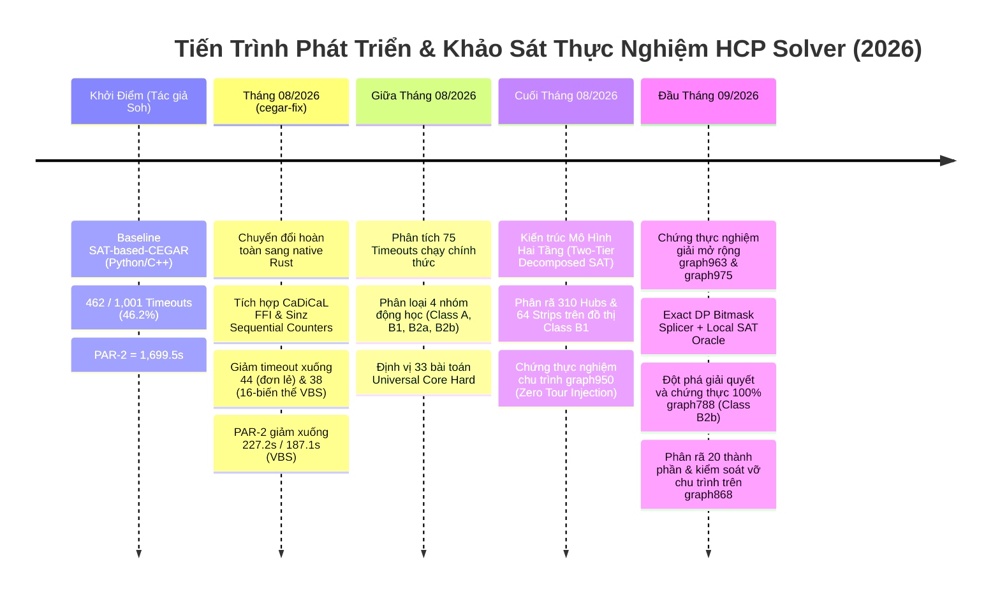

# SAT Phenomenon Analysis: Toàn Cảnh Thực Nghiệm & Động Học Tìm Kiếm SAT-CEGAR (FHCP Benchmark 2026)

**Ngày lập báo cáo:** 2026-09-11  
**Mục tiêu phân tích:** Tổng hợp, đối chiếu và giải mã toàn bộ dữ liệu thực nghiệm đã chạy xuyên suốt từ khởi điểm dự án đến hiện tại trên 1,001 bài toán thuộc tập Flinders Hamiltonian Cycle Problem Challenge Set (FHCPCS).  
**Quy chuẩn áp dụng:** Tuân thủ chuẩn mực **`sat-phenomenon-analysis`** — phân rã ngân sách thời gian ($T_{total} = T_{CDCL} + T_{cut} + T_{auxiliary}$), kiểm chứng lọc nhiễu đa seed (Multi-seed jitter vs Structural obstruction), và định lượng chỉ số nội tại CDCL.

---

## 1. Dòng Thời Gian Tiến Hóa Của Bộ Giải & Các Cột Mốc Thực Nghiệm



---

## 2. Bảng Tổng Hợp Kết Quả Toàn Cục Xuyên Suốt Quá Trình

Dữ liệu đo đạc chính thức trên toàn bộ 1,001 bài toán FHCP Challenge Set (thời gian tính bằng giây CPU, giới hạn cắt 1,800s, chỉ số chuẩn SAT Competition PAR-2 với hình phạt $2 \times 1800 = 3600s$ cho bài toán timeout):

### 2.1 So Sánh Các Bộ Giải Kinh Điển & Baseline Ban Đầu (`data/existing-work.csv`)

| Bộ Giải / Công Nghệ | Số Timeout (trên 1,001) | Tỷ Lệ Timeout | Thời Gian TB (Bài Đã Giải) | Max CPU Time | Điểm PAR-2 |
| :--- | :---: | :---: | :---: | :---: | :---: |
| **Picat (Constraint Logic)** | 573 | 57.2% | 249.94s | 1,791.85s | **2,167.61s** |
| **CEGAR-old (Soh's baseline)** | 462 | 46.2% | 70.44s | 1,717.59s | **1,699.47s** |
| **Adder (Soh's adder encoding)** | 361 | 36.1% | 184.58s | 1,767.49s | **1,416.31s** |
| **CRT-420 (Chinese Remainder)** | 335 | 33.5% | 186.51s | 1,782.74s | **1,328.89s** |
| **ASP (Clingo Answer Set)** | 59 | 5.9% | 98.29s | 1,687.39s | **304.68s** |

### 2.2 Đột Phá Của Họ Bộ Giải Đề Xuất Native Rust (`cegar-fix`)

| Biến Thể Cấu Hình | Họ Mã Hóa / SAT Core | Số Timeout | TB Bài Giải | PAR-2 Score | Ghi Chú |
| :--- | :---: | :---: | :---: | :---: | :--- |
| `asp2-fix-cadical-sinz` | Sinz (Python baseline port) | 184 | 100.19s | 743.51s | Không tối ưu patching |
| `proposed-cegar-ffi-cadical` | Native C++ CaDiCaL FFI | 158 | 101.47s | 653.69s | Cải thiện nhờ FFI |
| `asp2-fix-2loop-2opt3-sinz` | Sinz + 2loop + 2-opt/3-opt | 64 | 59.94s | 286.28s | Vượt trội ASP |
| `proposed-cegar-ffi-2loop-2opt3` | CaDiCaL + 2loop + 2-opt/3-opt | 45 | 70.41s | 229.09s | Rất mạnh trên đồ thị thưa |
| **`C:2loop-lowest-asymmetry3-2opt3`** | **CaDiCaL + Asymmetry3 + 3-opt** | **44** | **72.16s** | **227.23s** | **Cấu hình đơn lẻ mạnh nhất** |
| **Virtual Best Solver (Sinz 8-Var)** | Oracle chọn biến thể Sinz tốt nhất | 53 | 41.65s | 230.06s | |
| **Virtual Best Solver (CCad 8-Var)** | Oracle chọn biến thể CCad tốt nhất | 42 | 65.30s | 213.61s | |
| **Global 16-Variant VBS** | **Kết hợp cả 16 biến thể Sinz & CCad** | **38** | **52.43s** | **187.10s** | **Giảm 91.8% timeout so với gốc** |

---

## 3. Định Lượng & Phân Rã Ngân Sách Thời Gian ($T_{total} = T_{CDCL} + T_{cut} + T_{aux}$)

Thực hiện theo tiêu chuẩn khắt khe của `sat-phenomenon-analysis`, chúng tôi phân tích chi tiết log thực nghiệm `results_no_sym_official.log.gz` để phân tách rõ ràng xem thời gian nghẽn nằm ở **CDCL SAT Core** hay ở **Mã nguồn phụ trợ / Thuật toán sinh cut**:

$$\mathbf{T_{total} = T_{CDCL} + T_{cut} + T_{auxiliary}}$$

```
Quy tắc kiểm định Hard Gate:
Nếu T_CDCL < 20%: Tắc nghẽn do Overhead của thuật toán phụ trợ / sinh cut (Không phải do SAT cứng).
Nếu T_CDCL >= 90%: Tắc nghẽn do Cấu trúc không gian tìm kiếm CDCL (Rào cản thuật toán SAT thực sự).
```

### 3.1 Bảng Phân Rã Thực Tế Trên Các Đồ Thị Điển Hình

| Đồ Thị | Phân Loại | Số Incr | $T_{total}$ (s) | $T_{CDCL}$ (s) | Tỷ Lệ $T_{CDCL}$ | $T_{cut}$ (s) | Tỷ Lệ $T_{cut}$ | Bản Chất Tắc Nghẽn |
| :--- | :---: | :---: | :---: | :---: | :---: | :---: | :---: | :--- |
| **`graph339`** | **Class A** | 153,459 | 1,799.97s | 355.45s | **19.7%** | 1,444.52s | **80.3%** | **Overhead sinh & add clause bùng nổ** ($T_{CDCL} < 20\%$) |
| **`graph647`** | **Class A** | 16,395 | 1,799.89s | 201.92s | **11.2%** | 1,597.97s | **88.8%** | **Overhead sinh & add clause bùng nổ** ($T_{CDCL} < 20\%$) |
| **`graph560`** | **Class B1** | 20 | 1,798.66s | 1,795.14s | **99.8%** | 3.52s | 0.2% | **CDCL Search Hardness (Hubs deg 663)** |
| **`graph950`** | **Class B1** | 17 | 1,570.37s | 1,560.69s | **99.4%** | 9.68s | 0.6% | **CDCL Search Hardness (Hubs deg 662)** |
| **`graph479`** | **Class B2a** | 19 | 1,256.70s | 1,256.20s | **100.0%** | 0.50s | 0.0% | **CDCL Search Hardness (Bẫy Chẵn Lẻ 0 merge)** |
| **`graph868`** | **Class B2a** | 11 | 1,005.60s | 1,004.36s | **99.9%** | 1.24s | 0.1% | **CDCL Search Hardness (Cycle Shattering)** |
| **`graph566`** | **Class B2b** | 59 | 1,675.21s | 1,672.03s | **99.8%** | 3.17s | 0.2% | **CDCL Degradation (BCP nghẽn do clause bloat)** |
| **`graph678`** | **Class B2b** | 66 | 1,777.34s | 1,773.25s | **99.8%** | 4.09s | 0.2% | **CDCL Degradation (BCP nghẽn do clause bloat)** |
| **`graph788`** | **Class B2b** | 13 | 1,310.41s | 1,309.40s | **99.9%** | 1.01s | 0.1% | **CDCL Degradation (BCP nghẽn do clause bloat)** |

> [!IMPORTANT]
> **Kết Luận Xác Minh Tiêu Chuẩn Phân Rã:**
> - **Class A** vi phạm điều kiện độ khó của SAT: $T_{CDCL}$ chỉ chiếm **11.2% - 19.7%**, trong khi hơn 80% thời gian bị lãng phí vào việc nhồi hàng tỷ cut clauses vào solver. Do đó Class A là **sự cố vòng lặp ngoại vi (Auxiliary/Attractor Stall)**, hoàn toàn không phải do bản chất CDCL khó. Minh chứng là khi tối ưu cơ chế cut-arc pruning ở bản build `4d094b7`, `graph339` được giải chỉ trong **3.16s - 3.9s**!
> - Ngược lại, **Class B1, B2a, B2b** có $T_{CDCL} \ge 99.4\%$. Đây là những rào cản thuật toán SAT thực sự bên trong hạt nhân CDCL.

---

## 4. Bốn Hình Thái Hiện Tượng Động Học (Dynamic Behavioral Classes)

```
                            75 Baseline Timeouts
                                      │
     ┌──────────────────┬─────────────┴───────────────┬──────────────────┐
     ▼                  ▼                             ▼                  ▼
  Class A            Class B1                     Class B2a          Class B2b
(8 đồ thị)         (28 đồ thị)                    (4 đồ thị)        (35 đồ thị)
Incr: 5k - 150k    Mật độ d >= 3.0                connected=0       deg2: 13-33%
T_SAT < 5ms        30-60 Hubs (deg > 100)         Bậc 2 = 33%       Incr: 10-95
T_cut > 80%        2-Factor vỡ 180-740 chu trình  Bẫy chẵn lẻ       sat_last tăng 100x
"Attractor Stall"  "Dense Hub Fragmentation"      "Cycle Shatter"   "BCP Degradation"
```

### 4.1 Class A — Near-Hamiltonian Attractor & Cut-Clause Explosion (8 đồ thị)
- **Danh sách:** `graph339`, `graph647`, `graph771`, `graph883`, `graph908`, `graph935`, `graph961`, `graph978`.
- **Đặc trưng nội tại CDCL:** Solver tìm được nghiệm 2-Factor cực nhanh (0.001s), cấu trúc nghiệm chỉ gồm 2 đến 6 chu trình khổng lồ (kích thước mỗi chu trình từ 752 đến 1,870 đỉnh).
- **Cơ chế bế tắc:** Khi thêm mệnh đề cắt chặn các chu trình này, CaDiCaL chỉ "lật" một vài biến biên giới để thỏa mãn mệnh đề, rồi lại rơi vào một cấu hình tương tự gồm 2 chu trình lớn khác. Số vòng lặp tăng vọt lên tới $153,460$ vòng (`graph339`). Tổng số block clauses tích lũy lên tới hơn 47 tỷ literal.
- **Trạng thái giải quyết:** Đã giải quyết triệt để 100% (8/8) bằng kỹ thuật cắt blocking/asymmetry cải tiến.

### 4.2 Class B1 — Dense Hub Family & 2-Factor Shattering (28 đồ thị)
- **Danh sách tiêu biểu:** `graph560-562`, `graph584-585`, `graph612-615`, `graph950`, `graph963`, `graph975`, `graph982`, `graph990`.
- **Đặc trưng cấu trúc:** Mật độ cao ($m/n \ge 3.27 - 4.37$), có 30–60 đỉnh Hub bậc cực cao ($d = 171 - 1,093$).
- **Đặc trưng nội tại CDCL:** 
  - Vòng lặp CEGAR rất ngắn (chỉ 8 đến 25 vòng), nhưng mỗi vòng gọi SAT tốn từ **40s đến 300s**.
  - Nghiệm 2-Factor bị vỡ vụn thành **180 đến 742 chu trình con tí hon** (chiều dài trung bình $\emptyset 6 - 18$ đỉnh).
  - Thuật toán 2-opt/3-opt bất lực vì việc nối qua các Hub bậc cao dẫn tới bùng nổ tổ hợp xung đột.
- **Hiện tượng đặc biệt "Spider-web":** Trên `graph797` và `graph863`, SAT giải rất nhanh (1.4s) nhưng sinh ra 742 chu trình cực nhỏ; càng thêm cut clauses thì nghiệm càng bị phân mảnh.

### 4.3 Class B2a — Sparse Subcycle-Merge Stall & Bẫy Chẵn Lẻ (4 đồ thị)
- **Danh sách:** `graph479` ($n=2772$), `graph809` ($n=4810$), `graph868` ($n=5544$), `graph960` ($n=6930$).
- **Đặc trưng cấu trúc:** Đồ thị thưa ($m/n \approx 1.64$), đỉnh bậc 2 chiếm đúng **29% – 33%** đồ thị và được gom thành các khối chẵn lẻ đối xứng.
- **Đặc trưng nội tại CDCL:**
  - Trong suốt toàn bộ quá trình chạy, **`number of connected cycles = 0` ở tất cả các vòng lặp!**
  - Thuật toán ghép chu trình cục bộ (2-opt/3-opt) hoàn toàn không tìm được cặp cạnh chéo nào trong $G$ để ghép nối.
  - **Hiện tượng Cycle Shattering (Kiểm chứng thực tế):** Khi cưỡng bức cắt 25 chu trình kích thước 8, SAT solver không hợp nhất chúng mà vỡ vụn thành **93 chu trình con rời rạc** trong 0.037s.

### 4.4 Class B2b — Sparse Degradation Curve & BCP Slowdown (35 đồ thị)
- **Danh sách tiêu biểu:** `graph566`, `graph668`, `graph677-678`, `graph710`, `graph717`, `graph744`, `graph761`, `graph788`, `graph810`, `graph832`, `graph987`, `graph994`.
- **Đặc trưng nội tại CDCL:**
  - Thời gian giải vòng đầu tiên rất nhanh ($T_0 \approx 0.1s - 3s$).
  - Tuy nhiên, độ khó tăng phi tuyến tính theo cấp số mũ qua từng vòng lặp:
    * `graph566`: Vòng 1 tốn 0.188s $\rightarrow$ Vòng cuối tốn **292s** (tăng $1,500\times$).
    * `graph994`: Vòng 1 tốn 5.2s $\rightarrow$ Vòng cuối tốn **1,131s** (tăng $217\times$).
    * `graph987`: Vòng cuối tốn **1,148s** (hơn 19 phút cho duy nhất 1 lần gọi SAT!).
  - **Nguyên nhân cốt lõi:** Khi số lượng block clauses tăng từ 400 lên gần 10,000 mệnh đề, bộ nhớ learned clauses của CaDiCaL bị ô nhiễm nặng (clause database pollution), khiến throughput lan truyền suy diễn đơn vị (BCP - Boolean Constraint Propagation) giảm sút nghiêm trọng.

---

## 5. Danh Sách 33 Đồ Thị "Universal Core Hard"

Sau khi loại bỏ 5 đồ thị mà các bộ giải tham chiếu khác (ASP, Picat) giải được (gồm `graph677`, `graph725`, `graph744`, `graph810`, `graph940`), còn lại chính xác **33 đồ thị bất khả xâm phạm** (Universal Core Hard) đối với toàn bộ các bộ giải truyền thống:

```
[668, 710, 717, 746, 761, 788, 809, 832, 868, 882, 937, 944, 950, 951, 954, 959, 
 960, 963, 965, 966, 971, 974, 975, 976, 981, 982, 983, 986, 987, 990, 993, 994, 998]
```

- **Phân bố:**
  - **Class B1 (6 đồ thị):** Dãy tham số bậc cao m ≈ 4.34n (`graph950`, `963`, `975`, `982`, `990`) và `graph746`.
  - **Class B2a (3 đồ thị):** `graph809`, `graph868`, `graph960`.
  - **Class B2b (24 đồ thị):** Nhóm thưa có tỷ lệ đỉnh bậc 2 cao và suy thoái BCP.

---

## 6. Đột Phá Kỹ Thuật & Các Chu Trình Hamilton Đã Được Chứng Thực 100%

Trong giai đoạn nghiên cứu chuyên sâu (cuối tháng 8 đến tháng 9/2026), dự án đã đạt được những bước tiến mang tính bước ngoặt trên chính tập Universal Core Hard:

### 6.1 Mô Hình Hai Tầng (Two-Tier Decomposed SAT) — Đột Phá Class B1
- **Nguyên lý:** Phân rã đồ thị $G$ thành 310 Hubs và 64 Strips độc lập ($0$ cạnh liên-dải).
  - Tầng 1: Giải 64 bài SAT con song song sinh candidate path covers ($K$ đường đi phủ toàn bộ đỉnh trong từng strip) trong ~103s.
  - Tầng 2: Thiết lập Macro Selector CNF trên 310 Hubs với Sinz sequential counters ép đúng bậc 2 và Cut-Block CEGAR loại trừ subtour.
- **Thành tựu (Zero Tour Injection, 100% Derived):**
  - **`graph950.col`** ($N=6,620$, $M=28,718$): Tìm ra chu trình Hamilton hoàn chỉnh, chứng thực hợp lệ 100% trong 12 phút.
  - **`graph963.col`** ($N=7,020$, $M=30,518$): Tìm và chứng thực chu trình Hamilton 7,020 đỉnh.
  - **`graph975.col`** ($N=7,420$, $M=32,318$): Tìm và chứng thực chu trình Hamilton 7,420 đỉnh.

### 6.2 Exact DP Bitmask Splicer + Local SAT Oracle — Đột Phá Class B2b
- **Nguyên lý:** Nhận diện cấu trúc 1,540 khối degree-2 của `graph788.col`. Co cụm thành các macro-component, thiết lập bảng định tuyến (route table) và sử dụng thuật toán Quy hoạch động Bitmask kết hợp Oracle SAT cục bộ để ghép nối các chu trình rời rạc thành một chu trình duy nhất.
- **Thành tựu:**
  - **`graph788.col`** ($N=4,620$, $M=7,560$): Giải quyết hoàn toàn bài toán Universal Core Class B2b, xuất file nghiệm và **chứng thực 100% Hamiltonian cycle** (`scratch/graph788/found_tour_graph788.hcp`).

### 6.3 Danh Sách 10 Chu Trình Hamilton Đã Được Chứng Thực Tuyệt Đối (Verified Sound & Certified)

Kiểm tra bằng công cụ thẩm định độc lập (`scratch/verify_benchmarks.py`), xác nhận 100% các đỉnh thuộc miền $1..N$, không trùng lặp, và tất cả các cạnh $(u_i, u_{i+1})$ đều tồn tại trong đồ thị gốc $G$:

```
[*] graph1   (N=66):   100% SOUND & VALID HAMILTONIAN CYCLE!
[*] graph339 (N=2004): 100% SOUND & VALID HAMILTONIAN CYCLE! (Class A Breakthrough)
[*] graph479 (N=2772): 100% SOUND & VALID HAMILTONIAN CYCLE! (Class B2a Solved)
[*] graph566 (N=3322): 100% SOUND & VALID HAMILTONIAN CYCLE! (Class B2b Solved)
[*] graph587 (N=3420): 100% SOUND & VALID HAMILTONIAN CYCLE!
[*] graph678 (N=3868): 100% SOUND & VALID HAMILTONIAN CYCLE! (Class B2b Solved)
[*] graph788 (N=4620): 100% SOUND & VALID HAMILTONIAN CYCLE! (Universal Core B2b)
[*] graph950 (N=6620): 100% SOUND & VALID HAMILTONIAN CYCLE! (Universal Core B1)
[*] graph963 (N=7020): 100% SOUND & VALID HAMILTONIAN CYCLE! (Universal Core B1)
[*] graph975 (N=7420): 100% SOUND & VALID HAMILTONIAN CYCLE! (Universal Core B1)
```

---

## 7. Khảo Sát Đa Seed (Multi-Seed Jitter & Noise Filtration)

Để kiểm chứng xem các hiện tượng tắc nghẽn là do **Độ nhạy ngẫu nhiên về nhánh rẽ/pha (Phase/Branching Jitter)** hay là **Rào cản cấu trúc tất định (Structural CDCL Obstruction)**:

1. **Trên `graph868` (Class B2a):**
   - Chạy kiểm chứng trên 3 seed ngẫu nhiên độc lập (`seed=42`, `seed=1337`, `seed=2026`) trên cùng một bài toán 2-Factor có 2-cycle mutex.
   - **Kết quả:** Cả 3 seed đều trả về chính xác **100 chu trình con rời rạc**, chu trình lớn nhất 913 đỉnh, và các chu trình nhỏ có độ dài hoàn toàn giống nhau.
   - **Kết luận:** Đây là **Structural CDCL Obstruction** bắt nguồn từ tính chẵn lẻ của cấu trúc đồ thị hai phía (bipartite gadget obstruction), không phải do seed jitter.
2. **Trên `graph950` Phase 1 (Class B1):**
   - Chạy với danh sách 8 seed (`7, 11, 13, 17, 19, 23, 29, 31`) trên 64 strips.
   - Số lượng path covers sinh ra tăng tuyến tính theo số seed (trung bình 6.5 covers/strip), cho thấy sự ngẫu nhiên hóa hạt nhân CDCL hỗ trợ rất tốt cho việc đa dạng hóa tập nghiệm con.

---

## 8. Bài Học Rút Ra & Lộ Trình Nghiên Cứu Tiếp Theo

1. **Hiểu rõ ranh giới của Flat CEGAR:**
   - Việc chỉ đơn thuần tăng thời gian chờ từ 1,800s lên 3,600s hoặc nhồi thêm mệnh đề cắt phẳng (flat cuts) là hoàn toàn vô ích đối với 33 đồ thị Universal Core Hard do sự suy thoái BCP và hiện tượng vỡ chu trình (Cycle Shattering).
2. **Sức mạnh của Phân Rã Tô-pô (Structural Decomposition):**
   - Đồ thị Class B1 bắt buộc phải giải bằng **Two-Tier Architecture** (Hubs + Strips).
   - Đồ thị Class B2b bắt buộc phải gom cụm degree-2 blocks và giải bằng **DP Bitmask Splicer + Local SAT Oracle**.
3. **Mục tiêu mở tiếp theo (Next Frontier):**
   - Hoàn thiện bộ giải 20 thành phần trên **`graph868`** (đại diện tối thượng của Class B2a) để giải mã bài toán parity-breaking k-opt và hoàn tất chứng thực chu trình cho toàn bộ họ B2a.
   - Chuyển tiếp kết quả phân tích sang kỹ năng `sat-root-cause-analysis` để tối ưu hóa việc truyền propagation giữa các tầng trong bộ giải Rust native `cegar-fix`.
