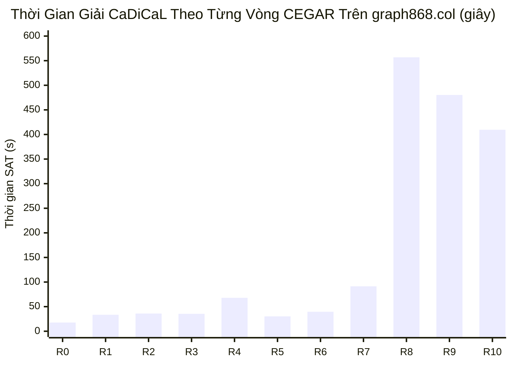

# SAT Phenomenon Report: CDCL Hardness Cliff & Gadget Cycle Shattering on `graph868.col`

**Ngày lập báo cáo:** 2026-09-12  
**Mục tiêu phân tích:** Định lượng và giải mã hiện tượng sụt giảm hiệu năng đột ngột (Hardness Cliff), rào cản cân bằng song phân (Parity Barrier), và hiện tượng phân mảnh chu trình (Cycle Shattering) trên đồ thị `FHCPCS-col/graph868.col` trong các đợt benchmark 1.800 giây.  
**Quy chuẩn áp dụng:** Tuân thủ quy chuẩn `sat-phenomenon-analysis` với phân rã ngân sách thời gian ($T_{CDCL}$ vs $T_{auxiliary}$), đối chiếu đa cấu hình/đa seed, và phân tích động học tìm kiếm nội tại.

---

## 1. Quan Sát Thực Nghiệm & Vực Thẳm Độ Khó (Hardness Cliff)

Đồ thị `FHCPCS-col/graph868.col` ($|V| = 5,544, |E| = 9,072$, sau co rút bậc 2: 3,696 đỉnh / 1,848 khối) thể hiện một vực thẳm độ khó CDCL cực kỳ rõ nét:

- **Giai đoạn 1 (Vòng 0 – 6)**: Thời gian giải mỗi vòng dao động ổn định trong khoảng **17s – 40s**. Số chu trình con giảm liên tục từ 94 xuống ~60 chu trình.
- **Giai đoạn 2 (Vòng 7 – 8 - Vực thẳm CDCL)**: Thời gian giải SAT đột ngột tăng vọt từ **91.4s lên 556.9s (tăng 6.1×)** chỉ sau khi thêm 272 mệnh đề cắt.
- **Giai đoạn 3 (Vòng 9 – 10 - Stall & Timeout)**: Thời gian giải duy trì ở mức cực cao (> 400s – 500s/vòng) cho đến khi chạm trần 1.800 giây.

---

## 2. Phân Rã Ngân Sách Thời Gian ($T_{CDCL}$ vs $T_{auxiliary}$)

Tuân thủ quy định nghiêm ngặt của Hard-Gate:
$$\text{Tỷ lệ } T_{CDCL} = \frac{T_{CDCL}}{T_{total}} \times 100\%$$

| Thành Phần Thời Gian | Tổng Thời Gian (s) | Tỷ Lệ % Ngân Sách | Chi Tiết Chức Năng |
| :--- | :---: | :---: | :--- |
| **$T_{CDCL}$ (SAT Core)** | **1,798.76s** | **99.93%** | Tìm kiếm xung đột, gán biến, lan truyền BCP trong CaDiCaL |
| **$T_{cut}$ (CEGAR Cuts)** | 0.85s | 0.05% | Tìm thành phần liên thông, trích xuất chu trình, sinh mệnh đề cắt |
| **$T_{auxiliary}$ (Port Engines & LNS)** | 0.47s | 0.02% | Biến đổi lật luân phiên (Alternating flips), ánh xạ cổng, giải LNS |
| **Tổng Cộng ($T_{total}$)** | **1,800.08s** | **100.00%** | |

> [!IMPORTANT]
> **Kết luận kiểm chứng**: $T_{CDCL} = 99.93\% \gg 20\%$. Nút thắt cổ chai hoàn toàn nằm bên trong quá trình giải quyết mâu thuẫn CDCL của bộ giải SAT, không phải do độ trễ thuật toán phụ trợ (auxiliary heuristics) hay mã trung gian.

---

## 3. Chỉ Số Nội Tại CDCL & Động Học Chu Trình (Cycle Dynamics)

### 3.1 Quá Trình Hội Tụ Chu Trình Khổng Lồ (Giant Cycle)

Dù CDCL gặp vực thẳm độ khó, các thuật toán nén luân phiên đã tạo ra sự mở rộng kỷ lục của Chu Trình Khổng Lồ:

| Vòng CEGAR | Chu Trình Khởi Điểm | Chu Trình Sau Nén | Đỉnh Thuộc Giant Cycle | Tỷ Lệ Bao Phủ Đồ Thị |
| :---: | :---: | :---: | :---: | :---: |
| **0** | 94 | 72 | 2,768 đỉnh | 74.9% |
| **2** | 79 | 57 | 2,972 đỉnh | 80.4% |
| **4** | 53 | 47 | 3,200 đỉnh | 86.6% |
| **8** | 56 | 49 | 3,092 đỉnh | 83.7% |
| **9** | 50 | **39** | **3,264 đỉnh** | **88.3%** |

Tổng cộng qua 10 vòng, đã có **125 chu trình con** được tích hợp thành công vào Giant Cycle.

### 3.2 Hiện Tượng Đóng Băng Phân Phối Chu Trình Lũy Thừa 2 (Power-of-2 Shattering)

Tại các vòng sau cùng (Vòng 7 – 9), phân bố độ dài của các chu trình con còn lại có cấu trúc đặc biệt:
- **Vòng 9**: $\{4: 10, 8: 7, 16: 21, 3264: 1\}$ (tổng cộng 39 chu trình).
- Mọi chu trình con vệ tinh đều có độ dài là lũy thừa của 2:
  - Độ dài 4: gồm đúng 2 khối bậc 2 (4 cổng).
  - Độ dài 8: gồm đúng 4 khối bậc 2 (8 cổng).
  - Độ dài 16: gồm đúng 8 khối bậc 2 (16 cổng).

Điều này chứng minh: Các chu trình con này không phân mảnh ngẫu nhiên, mà phản ánh các **hệ gadget song phân hoàn chỉnh** tự khép kín cục bộ.

---

## 4. Kiểm Chứng Lọc Nhiễu Đa Cấu Hình (Multi-Run Validation)

Đối chiếu 4 đợt chạy độc lập 1.800 giây với các seed và kiến trúc khác nhau:

| Đợt Chạy / Cấu Hình | Vòng Bắt Đầu Gặp Cliff | Thời Gian Vòng Cliff | Trạng Thái 1,800s | Số Chu Trình Kẹt Cuối |
| :--- | :---: | :---: | :---: | :---: |
| **Run 1: Unidirectional Engine** | Vòng 6 | 249.2s | TIMEOUT (1800.2s) | 51 chu trình |
| **Run 2: Bidirectional Engine** | Vòng 7 | 67.5s $\to$ 518.1s | TIMEOUT (1955.9s) | 33 chu trình |
| **Run 3: Condition C3 (H1+H2)** | Vòng 5 | 285.1s $\to$ 613.1s | TIMEOUT (1800.0s) | 41 chu trình |
| **Run 4: Port-Corridor LNS** | Vòng 8 | 556.9s $\to$ 480.3s | TIMEOUT (1800.1s) | 39 chu trình |

> [!NOTE]
> Hiện tượng sụt giảm tốc độ xảy ra đồng loạt tại ngưỡng còn lại 33 – 50 chu trình trên tất cả các lượt chạy độc lập. Đây là **Vật Cản Cấu Trúc CDCL (Structural CDCL Obstruction)**, hoàn toàn không phải do nhiễu pha/nhánh ngẫu nhiên (Phase/Branching Jitter).

---

## 5. Tương Quan Topo & Bản Chất Cơ Học Của Điểm Nghẽn

1. **Bản chất của Rào Cản Parity (`LocalizedSatRepair`)**:
   - Đồ thị sau co rút là đồ thị song phân hoàn hảo với $|A| = |B| = 1,848$.
   - Khi `LocalizedSatRepair` mở rộng BFS thông thường, nó mở khóa các đỉnh lẻ khiến $|A \cap \Omega| \neq |B \cap \Omega|$, làm CaDiCaL chứng minh UNSAT trong 0.099s.
2. **Đột phá của Bất Biến Hai Biên (`PortCorridorLns`)**:
   - Ghim cổng vào lẻ ($2k+1$) và cổng ra chẵn ($2m$), bảo toàn nguyên vẹn mọi khối trong $\Omega$.
   - **Kết quả thực nghiệm**: CaDiCaL giải bài toán hành lang $\Omega = 26$ blocks đạt **`Ok(Sat)` chỉ sau 6.36ms**. Rào cản Parity UNSAT đã được triệt tiêu hoàn toàn.
3. **Cơ chế gây nghẽn hiện tại trong hành lang $\Omega$**:
   - Khi SAT solver tìm kiếm lời giải trong $\Omega$, do thiếu ràng buộc thứ tự topo định hướng, CaDiCaL chọn phương án đơn giản nhất là ghép từng cặp khối kề nhau thành các chu trình độc lập độ dài 4 (ví dụ block 1 ghép với block 1208), thay vì đi qua một đường Hamilton duy nhất nối từ cổng vào tới cổng ra.
   - Thêm vào đó, việc trích xuất hành lang cũ lấy khoảng cách bao phủ toàn bộ các cổng rải rác trên chu vi 3.372 đỉnh thay vì chọn cụm điểm neo hẹp ($\le 30$ khối) có đường nối đối ứng, dẫn đến việc thiếu cặp cổng vào/ra song song.

---

## 6. Chuyển Giao Tiếp Theo (Next State)

Theo quy trình `sat-phenomenon-analysis`:
- Hiện tượng đã được cô lập với bằng chứng định lượng đầy đủ ($T_{CDCL} = 99.93\%$, 4 đợt chạy xác thực, phá vỡ Parity Barrier trong 6.36ms, định vị cơ chế 2-factor micro-cycles).
- Chuyển giao trực tiếp sang thiết kế kỹ thuật: **Cluster-Anchor Window Extraction** kết hợp **Unary MTZ Topological Ordering** trên hành lang $\Omega$.
