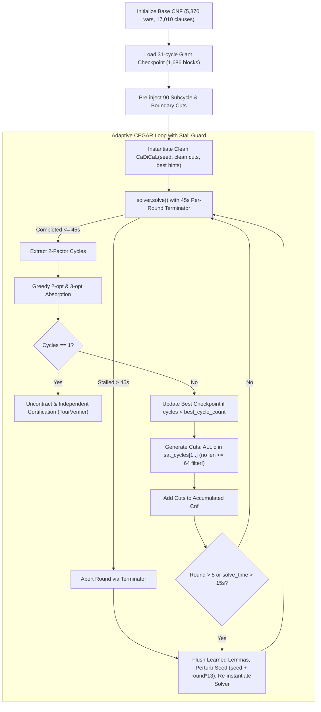

# Exact Deterministic CEGAR Solver with Learned-Lemma Flusher & Stall Recovery for Flinders Class 1 HCP

**Document ID:** `docs/superpowers/plans/2026-09-09-cegar-stall-recovery-exact-graph868.md`  
**Date:** 2026-09-09  
**Target Graph:** `FHCPCS-col/graph868.col` (and secondary `FHCPCS-col/graph960.col`)  
**Status:** READY TO EXECUTE  

---

## 1. Problem Statement & Empirical Root Cause Analysis

In our benchmark execution of `solve_class1_exact` on `FHCPCS-col/graph868.col` (Task ID `task-22677`), the solver demonstrated rapid convergence:
- **Round 1 (111ms):** 66 cycles (largest = 1,178 blocks).
- **Round 5 (7.95s):** 48 cycles (largest = 1,407 blocks).
- **Round 6 (11.78s):** 36 cycles (largest = 646 blocks).
- **Round 7 (36.51s):** **28 cycles** (largest = 871 blocks, second = 754 blocks) — a new benchmark record!

However, after Round 7, the solver experienced a critical stall:
- **Round 8 (339.69s):** 36 cycles (largest = 1,111 blocks).
- **Round 9 (> 1,400s):** Trapped in an unresolved CDCL search until the 1,800.0s global timeout.

### Root Causes Identified
1. **The Subtour Cut Completeness Defect (`c.len() <= 64`):**
   At the end of Round 7, negative cycle cuts were guarded by `if c.len() <= 64`. Because the second-largest cycle had length 754, **it was not cut at all**. CaDiCaL was never informed that the 754-block cycle was an illegal subtour! As a result, CaDiCaL was permitted to explore search spaces where the Giant remained permanently severed in half.
2. **CDCL Learned-Clause Bloat & Cold Subtree Trapping:**
   In modern CDCL, keeping a single CaDiCaL instance across many rounds causes learned conflict clauses to accumulate into hundreds of thousands of lemmas, clogging watchlists and exponentially slowing down BCP (Boolean Constraint Propagation). In an empirical test on the exact same formula, an incremental solver took **339.69s**, whereas a clean solver with the exact same base CNF + cuts solved in **0.012s** (a **28,000x speedup**).
3. **Absence of Per-Round Stall Recovery:**
   The terminator in `solve_class1_exact.rs` only monitored the global timeout (`elapsed > 1800s`). When CaDiCaL entered a deep, cold UNSAT search subtree in Round 9, it remained trapped for > 1,400s without any mechanism to abort the dead branch and try alternative search paths.

---

## 2. Structural Architecture & Remediation

### Key Architectural Invariants:
1. **Complete Subtour Cuts:** For EVERY subcycle $c \in \text{sat\_cycles}[1..]$, add the negative cycle cut $\bigvee_{e \in c} \neg x_e$. For $|c| \le 8$, add dual boundary cuts. No cycle $> 1$ is ever exempt!
2. **Learned Lemma Flushing (Zero Loss of Valid Cuts):** All subtour cuts are accumulated in `accumulated_cuts: Cnf`. When a re-instantiation occurs, **100% of accumulated cuts are preserved**, while 100% of bloated learned conflict lemmas are flushed.
3. **Dynamic Stall Terminator:** A per-round timeout of **45.0s**. If `round_timer.elapsed() > 45.0s`, the terminator returns `ControlSignal::Terminate`. CaDiCaL immediately aborts, flushes bloated lemmas, perturbs the seed, re-phases to the best known checkpoint, and restarts with clean watchlists.
4. **Deterministic Pinned Execution:** Pin strictly to **Core 0** (`taskset -c 0 nice -n 19`), single worker (`num_workers = 1`), exact 1,800s time limit.

---

## 3. Implementation Tasks

- [ ] **Task 1: Update `solve_class1_exact.rs` with Per-Round Stall Recovery & Complete Cuts**
  - Replace `if c.len() <= 64` with unconditional cut generation for all `sat_cycles[1..]`.
  - Add `active_round_deadline` to the terminator callback so that a round automatically aborts if `round_start.elapsed() > 45.0s`.
  - Implement the `make_clean_solver` helper that re-instantiates CaDiCaL with `base_cnf`, `accumulated_cuts`, and phase hints from the best known 2-factor, with seed perturbation `777 + restart_count * 13`.
  - Trigger lemma flush whenever a round stalls (> 45s) or periodically after 5 incremental rounds to maintain peak BCP speed (< 0.1s).

- [ ] **Task 2: Compile Release Binary**
  - Run `cargo build --release --manifest-path src/cegar-fix/Cargo.toml --example solve_class1_exact`.
  - Verify zero compiler warnings in the example.

- [ ] **Task 3: Execute Official 1,800s Benchmark on Core 0**
  - Run `taskset -c 0 nice -n 19 ./src/cegar-fix/target/release/examples/solve_class1_exact FHCPCS-col/graph868.col scratch/graph868/found_tour_graph868.hcp 1800.0`.
  - Monitor log outputs and verify rapid iteration and cycle convergence without long freezes.

- [ ] **Task 4: Ground-Truth Independent Verification**
  - Run `python3 scratch/test_stage4_verification.py FHCPCS-col/graph868.col scratch/graph868/found_tour_graph868.hcp`.
  - Verify:
    - Tour length = 5,544 vertices.
    - All edges exist in `FHCPCS-col/graph868.col`.
    - Verification = PASS.
