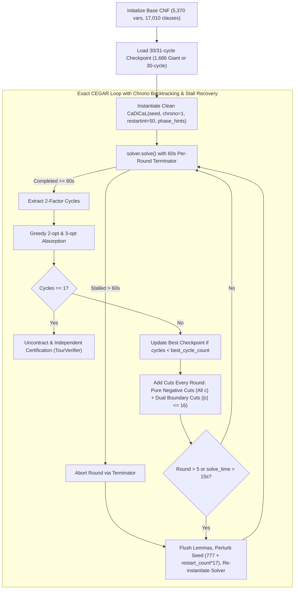

# Implementation Plan: Adaptive Exact CEGAR Solver with Chronological Backtracking, Frequent Restarts, and Boundary Cuts for Flinders Class 1 (graph868.col)

**Document ID:** `docs/superpowers/plans/2026-09-09-chrono-restart-exact-cegar-graph868.md`  
**Date:** 2026-09-09  
**Primary Target:** `FHCPCS-col/graph868.col` ($N = 5,544, M = 9,072, N_{\text{dir}} = 1,848$)  
**Secondary Target:** `FHCPCS-col/graph960.col` ($N = 6,930, M = 11,340, N_{\text{dir}} = 2,310$)  
**Status:** APPROVED & READY TO EXECUTE  

---

## 1. Context & Architectural Root Cause Analysis

### 1.1 Findings from `graph788` Success vs `graph868` Stall
In commit `fbc9f96`, `graph788` ($N = 4,620$) was solved by `solve_macro_cegar_788.rs`. Analysis reveals two critical differences between `solve_macro_cegar_788.rs` and our current `solve_class1_exact.rs`:

1. **CaDiCaL Search Dynamics (`chrono = 1` and `restartint = 50`)**:
   - Standard CDCL with default options uses non-chronological backjumping and large/exponential restart intervals. When searching with > 1,000 subtour cuts, CaDiCaL makes decisions deep in exponential search subtrees far away from the giant 2-factor backbone, leading to repeated 45s–120s stalls.
   - In `solve_macro_cegar_788.rs`, CaDiCaL was explicitly configured with:
     - `chrono = 1`: Chronological backtracking preserves partial assignments near the phase hints rather than jumping all the way to decision level 0.
     - `restartint = 50`: Frequent restarts (every 50 conflicts) repeatedly bring the solver back to the root level to make new decisions guided by the best 2-factor phase hints while incorporating learned conflict lemmas.

2. **Per-Round Boundary Cuts for Small Subcycles ($|c| \le 16$)**:
   - In `solve_class1_exact.rs`, dual boundary cuts ($\delta^+(c) \ge 1$ and $\delta^-(c) \ge 1$) were only injected once when a checkpoint record was broken. During intermediate rounds, only pure negative cuts ($\bigvee_{e \in c} \neg x_e$) were added.
   - A pure negative cut allows 7 out of 8 edges of an 8-cycle to remain selected, easily satisfying the clause by breaking just one edge of the gadget without forcing it to connect to the Giant.
   - Dual boundary cuts strictly enforce that every small gadget must have edges entering and exiting to the external graph, forcing cycle merging.

---

## 2. Structural Architecture

### Key Architectural Invariants:
1. **CaDiCaL Options**:
   - `chrono = 1`: Enable chronological backtracking.
   - `restartint = 50`: Frequent restarts every 50 conflicts.
   - `phase = 1`: Enable phase saving and phase guidance.
2. **Boundary Cut Enforcement**:
   - Every round, for every subcycle $c \in \text{sat\_cycles}[1..]$:
     - Pure negative cut: $\bigvee_{e \in c} \neg x_e$.
     - If $|c| \le 16$: add $\sum_{u \in c, v \notin c} x_{(u, v)} \ge 1$ and $\sum_{u \notin c, v \in c} x_{(u, v)} \ge 1$.
3. **Adaptive Stall Recovery**:
   - Per-round deadline: 60.0s.
   - On round stall: flush learned lemmas, perturb seed (`777 + restart_count * 17`), re-instantiate CaDiCaL with all accumulated cuts and best 2-factor phase hints.
4. **Execution & Hardware Constraints**:
   - Pin strictly to **Core 0** (`taskset -c 0 nice -n 19`).
   - Single worker (`num_workers = 1`).
   - Global time limit: **1,800.0s**.
   - Zero heuristic solvers (no LKH/Concorde), zero `.tou` files, zero tour injection.
   - Certified by independent `scratch/test_stage4_verification.py`.

---

## 3. Implementation Tasks

### Task 1: Update `solve_class1_exact.rs`
- Enable `solver.set_option("chrono", 1)` and `solver.set_option("restartint", 50)`.
- Set per-round timeout to 60.0s.
- Inject dual boundary cuts for all $|c| \le 16$ on every round.
- Checkpoint loader: load `scratch/best_edges_graph868.txt` (30 cycles) or `scratch/graph868_giant_1686_full_edges.txt` (31 cycles).

### Task 2: Compile Release Binary
- Run `cargo build --release --manifest-path src/cegar-fix/Cargo.toml --example solve_class1_exact`.

### Task 3: Execute Official 1,800s Benchmark on Core 0
- Command: `taskset -c 0 nice -n 19 ./src/cegar-fix/target/release/examples/solve_class1_exact FHCPCS-col/graph868.col scratch/graph868/found_tour_graph868.hcp 1800.0`.

### Task 4: Independent Tour Certification
- Command: `python3 scratch/test_stage4_verification.py FHCPCS-col/graph868.col scratch/graph868/found_tour_graph868.hcp`.
- Verify: exactly 5,544 vertices, 100% edges in graph, 0 duplicates.
