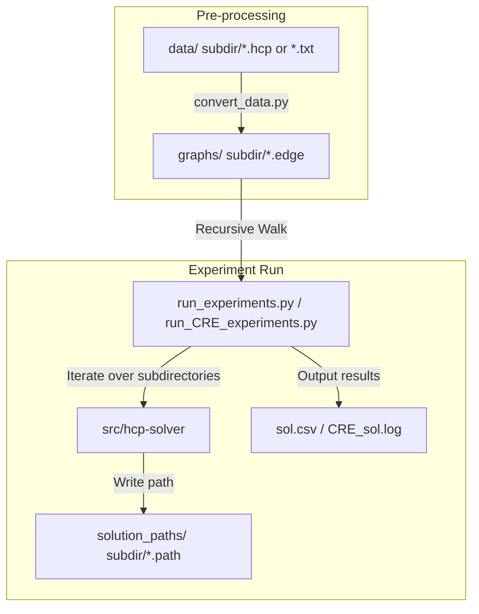

# Design Spec: Support Running All Data Formats in HCP/data

**Date:** 2026-07-06  
**Status:** Under Review  

---

## 1. Problem Statement

To run benchmark experiments on all graph datasets located in the `HCP/data/` subdirectories (`fhcpcs/`, `fhcppp/`, `fhcpsl/`, `tsphcp/`, and `vset/`), we must address two key issues:
1. **Format Discrepancies:** The solver (`src/hcp-solver`) and reference implementation (`refs/ChineseRemainderEncoding/hcp-encode`) only support the standard DIMACS edge format (`p edge <nodes> <edges>` and `e <u> <v>`). The data files in `data/` use TSPLIB `.hcp` format or a custom `.txt` format without the `e ` prefix.
2. **Directory Structure:** The experiment scripts (`run_experiments.py` and `run_CRE_experiments.py`) currently look for `.edge` files in a single flat directory `HCP/graphs/` and do not recurse into subdirectories.

We will build a batch conversion pre-processing script (`scripts/convert_data.py`) to convert all files under `HCP/data/` to standard DIMACS edge format, maintaining the directory structure under `HCP/graphs/`. Then, we will update the experiment runner scripts to walk `HCP/graphs/` recursively.

---

## 2. Architecture & Data Flow



---

## 3. Detailed Specifications

### 3.1. Conversion Script (`scripts/convert_data.py`)
This script will be executed once to prepare the dataset.
- **Input Dir:** `HCP/data/`
- **Output Dir:** `HCP/graphs/`
- **Logic:**
  1. Recursively walk through `HCP/data/` and find files.
  2. For each file, create the corresponding target subdirectory under `HCP/graphs/`.
  3. If the file ends with `.hcp`:
     - Read the file line-by-line.
     - Extract `DIMENSION : <nNode>`.
     - After hitting `EDGE_DATA_SECTION`, collect all edge pairs `<u> <v>` until reading `-1` or `EOF`.
     - Write to the output `.edge` file:
       ```
       p edge <nNode> <nEdge>
       e <u> <v>
       ...
       ```
  4. If the file ends with `.txt` (primarily in `vset`):
     - Read the header line `p edge <nNode> <nEdge>`.
     - Read the subsequent lines `<u> <v>`.
     - Write to the output `.edge` file, prefixing each edge line with `e `.
  5. The output filename will preserve the original base name and use `.edge` as the extension. For example:
     - `HCP/data/fhcpcs/graph1.hcp` -> `HCP/graphs/fhcpcs/graph1.edge`
     - `HCP/data/vset/v-39-3.txt` -> `HCP/graphs/vset/v-39-3.edge`

### 3.2. Script Updates (`run_experiments.py` & `run_CRE_experiments.py`)
Both scripts must be updated to handle the new directory structure:
- **Recursive Walk:** Replace `os.listdir(graphs_dir)` with a recursive walk using `os.walk(graphs_dir)` to collect all `.edge` files.
- **Relative Path Identifiers:** Store and process graph files as relative paths from the root `graphs/` directory (e.g., `fhcpcs/graph1.edge`). This maintains directory grouping in logging output.
- **Dynamic Path Directory Creation:** In `run_experiments.py`, when copying solution paths to `solution_paths_dir`, ensure the target directory is created dynamically:
  ```python
  dest_path = os.path.join(solution_paths_dir, f"{graph_name}.path")
  os.makedirs(os.path.dirname(dest_path), exist_ok=True)
  ```
  This prevents `FileNotFoundError` during copy actions.

---

## 4. Test & Verification Plan

1. **Conversion Verification:**
   - Run `python3 scripts/convert_data.py`.
   - Verify that `graphs/` contains subdirectories: `fhcpcs/`, `fhcppp/`, `fhcpsl/`, `tsphcp/`, `vset/`.
   - Manually inspect a few converted files (e.g., `graphs/fhcpcs/graph1.edge` and `graphs/vset/v-39-3.edge`) to ensure they match standard DIMACS edge format.
2. **Dry Run on Subsets:**
   - Run both scripts on a subset of the converted files (using options or limiting parameters if available) to verify that execution, logging, and solution copy behave correctly.
3. **Full Run:**
   - Execute the updated experiment scripts on the entire suite and check the generated `sol.csv` and `CRE_sol.log`.
