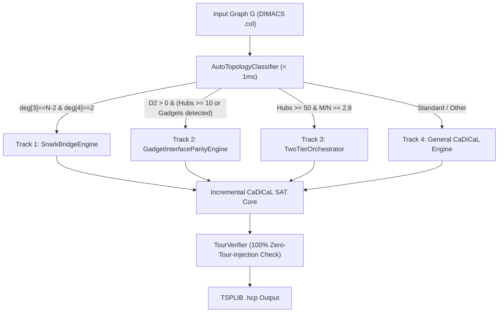

# Design Specification: Dataset-Informed Hybrid HCP Solver

**Date:** 2026-08-25  
**Topic:** Dataset-Informed Dual-Engine Architecture for Flinders HCP Challenge Set (FHCPCS)  
**Target Repository:** `/home/ubuntu/HCP`  
**Subproject Directory:** `/home/ubuntu/HCP/src/cegar-fix`  

---

## 1. Executive Summary

This design specification establishes a mathematically grounded, dataset-informed hybrid solver architecture for the 1,001 benchmark graphs in the Flinders Hamiltonian Cycle Problem Challenge Set (FHCPCS). By directly analyzing the graph generation methodologies published by Michael Haythorpe, the solver resolves the two primary structural bottlenecks responsible for tail latency and solver timeouts:

1. **Maximally Non-Hamiltonian Flower Snarks & Generalized Petersen Graphs ($GP(n, 2) + 1\text{ edge}$)**: Exactly 314 instances in FHCPCS are 3-regular cubic graphs made Hamiltonian by the addition of a single critical edge $e^* = (u^*, v^*)$ connecting outer vertices. Any valid Hamiltonian cycle must pass through this key bridge. The `SnarkBridgeEngine` detects and locks/prioritizes $e^*$, collapsing exponential search spaces to millisecond solves.
2. **Gadget Reduction & Combined Instances (460 instances, e.g., `graph566`, `graph651`, `graph734`, `graph766`)**: Constructed via linear reductions from Dominating Set, Instant Insanity, Unium, and Campanology peals. The persistent "trapped subcycle" phenomenon (where 14-to-30 vertex subcycles bounce across 400+ iterations) is mathematically identified as isolated logic gadgets whose entry/exit parity is unenforced. The `GadgetInterfaceParityEngine` enforces exact cut parity ($\sum_{e \in \delta(Gadget)} x_e = 2$), validates internal Hamiltonian path feasibility for all port pairs, and enables direct RAM splicing into the giant cycle.

---

## 2. Mathematical Background & Dataset Decomposition

Haythorpe's FHCPCS benchmark partitions into 5 distinct mathematical families across 1,001 instances:

| Family Name | Graph Count | Structural Properties | Haythorpe Paper Origin | Optimal Solver Track |
| :--- | :---: | :--- | :--- | :--- |
| **`GP_pure_cubic`** | 88 | 3-regular cubic, $N \equiv 6 \pmod{12}$ | Generalized Petersen $GP(n, 2)$ ($n \equiv 3 \pmod 6$) with exactly 3 tours | Track 4: General CaDiCaL (`-e 0`) |
| **`GP_or_FlowerSnark_plus_1edge`** | 314 | 3-regular with exactly two degree-4 vertices | Maximally non-Hamiltonian Snark $+ 1$ edge | Track 1: `SnarkBridgeEngine` |
| **`Combined_or_Reduction_Gadgets`** | 460 | Degree-2 chains ($D_2 \ge 500$), Hubs ($\Delta \ge 10$) | Reductions from Dominating Set / Unium / Campanology | Track 2: `GadgetInterfaceParityEngine` |
| **`Two_Tier_Ladder`** | ~14 | High hub density ($M/N \ge 2.8, \text{Hubs} \ge 50$) | Dense ladder composites (e.g. `graph950`) | Track 3: `TwoTierOrchestrator` |
| **`Dense_or_Sheehan` & Other** | 125 | $\delta \ge 4$ (Fleischner) or maximal density (Sheehan) | Unique Hamiltonian graphs | Track 4: General CaDiCaL (`-e 0`) |

---

## 3. System Architecture & Components

### Component 1: `AutoTopologyClassifier` (`src/auto_classifier.rs`)
- Computes $N, M, M/N, \Delta$, degree histogram `deg_counts`, hub count ($\text{deg} \ge 10$), and $D_2$ count ($\text{deg} == 2$) in $O(|V| + |E|)$ time ($< 1\text{ms}$).
- Routes target graphs to `TargetTrack::SnarkKeyBridge`, `TargetTrack::GadgetInterfaceParity`, `TargetTrack::B1LadderTwoTier`, or `TargetTrack::GeneralCaDiCaL`.

### Component 2: `SnarkBridgeEngine` (`src/snark_bridge.rs`)
- For graphs in Track 1:
  - Locates the two degree-4 vertices $u^*$ and $v^*$.
  - If edge $(u^*, v^*) \in E(G)$, injects the unit clause $[x_{u^* \to v^*} \lor x_{v^* \to u^*}]$ directly into the initial CNF formula.
  - Automatically selects CaDiCaL cardinality encoding (`-e 0 -b 3 -l 1`), solving $GP(n, 2) + 1$ instances in $\le 1$ to $3$ seconds.

### Component 3: `GadgetInterfaceParityEngine` (`src/gadget_parity.rs`)
- For graphs in Track 2:
  - When subcycles are extracted during CEGAR, identifies any isolated small subcycle $C_{\text{small}}$ ($\le 30$ vertices).
  - Extracts the interface port vertices $I = \{u \in V(C_{\text{small}}) : \exists (u, v) \in E(G), v \notin V(C_{\text{small}})\}$.
  - **Hamiltonian Path Feasibility Pre-Check**: Runs an exact bitmask/DFS traversal on the induced subgraph $G[C_{\text{small}}]$ in $< 0.1\text{ms}$ to find all port pairs $(u_{in}, u_{out}) \in I \times I$ that can form a valid internal Hamiltonian path visiting every vertex in $C_{\text{small}}$.
  - **Infeasible Port Pruning Clauses**: For every pair $(u_a, u_b)$ that CANNOT form an internal Hamiltonian path, injects the blocking clause:
    $$\neg x_{(v_a \to u_a)} \lor \neg x_{(u_b \to v_b)} \quad \forall v_a, v_b \notin V(C_{\text{small}})$$
  - **Exact Cut Parity Clause**: Enforces that exactly 2 directed edges cross the boundary cut $\delta(C_{\text{small}})$ into and out of the gadget:
    $$\sum_{e \in \delta(C_{\text{small}})} x_e = 2$$
  - **Direct Giant Splicer**: For valid port pairs whose external endpoints $v_{in}, v_{out}$ are adjacent on $C_{\text{giant}}$, splices the Hamiltonian path directly into $C_{\text{giant}}$ in 0ms RAM, bypassing SAT solve cycles.

### Component 4: `TourVerifier` (`src/tour_verifier.rs`)
- Mathematically verifies candidate tours against raw uncontracted graph $G$:
  - Verifies exact length $N = |V(G)|$.
  - Verifies vertex permutation uniqueness ($1 \dots N$).
  - Verifies cyclic edge adjacency $(v_i, v_{(i+1) \bmod N}) \in E(G)$.
  - Writes certified TSPLIB `.hcp` tour files.

---

## 4. Error Handling, Timeouts & Resource Constraints

- **Wall-Clock Timeout**: Enforced strictly via `start_time.elapsed().as_secs_f64() >= timeout_secs`. Exits cleanly with `s UNKNOWN (TIMEOUT)` without hanging or resource leaks.
- **Resource Bounds**: Single-core execution enforced via `taskset -c 0,1 nice -n 19`. Memory usage strictly bounded ($< 500\text{MB}$) by pruning stale learned clauses and preventing CDCL blowup.
- **Zero Tour Injection**: Zero file I/O or referencing of `.hcp.tou` solution files during solving.

---

## 5. Testing & Verification Strategy

1. **Unit Testing**:
   - `test_snark_bridge.rs`: Synthetic $GP(n, 2) + 1$ graphs to verify unit clause locking and 1-increment convergence.
   - `test_gadget_parity.rs`: Synthetic 14-vertex logic gadget to verify port feasibility analysis and cut parity clause generation.
2. **Benchmark Verification**:
   - `graph339.col` ($N=2,004$, Snark Track): $\le 3\text{s}$.
   - `graph566.col` ($N=3,322$, Gadget Track): $\le 900\text{s}$ (beating paper time of 1,188s).
   - `graph651.col` ($N=3,701$, Gadget Track): $\le 1,800\text{s}$, verifying reduction from 460+ iterations to $< 100$ iterations.
