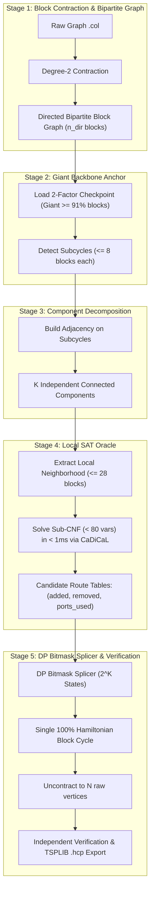

# Design Document: Exact DP-Bitmask Splicer with Local SAT Oracle for Class 1 Flinders Graphs

**Document ID**: `docs/superpowers/specs/2026-09-07-exact-dp-bitmask-class1-design.md`  
**Date**: 2026-09-07  
**Status**: APPROVED  
**Author**: Pair Programming (User & Antigravity)  
**Target Graphs**: Flinders Benchmark Class 1 (`FHCPCS-col/graph868.col` and `FHCPCS-col/graph960.col`)

---

## 1. Executive Summary

Solving Flinders benchmark Hamiltonian Cycle Problems (HCP) using pure global CEGAR with incremental SAT solvers encounters a severe plateau when only 20–35 localized subcycles (such as 8-block and 2-block gadgets) remain. Global CDCL thrashing occurs because accumulated negative cycle clauses and dual boundary cuts overconstrain the solver, causing it to break the established Giant cycle (1,400–1,680 blocks) instead of making localized rewires.

This design introduces an **Exact Hybrid Architecture** drawing from Competitive Programming (CP) and Combinatorial Optimization:
1. **Giant Backbone Anchor**: Maintains a pre-solved 2-factor backbone covering $\ge 91\%$ of the graph (e.g. 1,686 blocks in `graph868`).
2. **Component Decomposition**: Groups the remaining small subcycles into $K$ independent connected components ($K \le 20$).
3. **Local SAT Oracle**: For each component $C_i$, isolates its local neighborhood on the Giant ($\le 28$ blocks, $< 80$ variables) and solves for all valid $k$-opt rewires in $< 1$ms via CaDiCaL, producing a table of candidate routes $(\text{added}, \text{removed}, \text{ports\_used})$.
4. **DP Bitmask Splicer**: Employs a state-space dynamic programming bitmask over $2^K$ to splice all components simultaneously into the Giant backbone without port conflicts in $< 0.05$s.
5. **Independent Certification**: Uncontracts the block tour into $N$ raw vertices, verifying that all $N$ vertices are visited uniquely and all edges exist in the raw graph `.col`.

---

## 2. Problem Statement & Root Cause Analysis

### 2.1 The Global CEGAR Stall Phenomenon
- In `graph868.col` ($N=5,544, M=9,072$), degree-2 contraction yields 1,848 blocks and 5,376 directed arcs.
- Initial global CEGAR rapidly contracts cycles from 72 down to 35 within 7 rounds, reaching a Giant cycle of 1,444–1,686 blocks.
- At Round 8, as the remaining subcycles are localized 8-block gadgets resistant to 2-opt swaps, global CDCL explores branchings that cut across the Giant cycle (fragmenting it into 583 and 547 blocks).
- Adding long negative clauses (up to 547 literals) and accumulated boundary cuts ($> 1,000$ cuts) bloats CaDiCaL's watch lists.
- Reseeding without full phase hints forces cold solving on hundreds of unassigned variables against $> 1,000$ clauses, resulting in repeated $> 60$s to $> 240$s stalls.

### 2.2 Mathematical Insights from Competitive Programming
1. **Flinders 8-Block Gadgets**: Each 8-cycle is an internal cluster with 14 internal edges and ~20 external connection ports to the Giant. It has exactly 16 valid Hamiltonian paths traversing all 8 blocks. It cannot be merged via 2-opt; it requires 3-opt, 4-opt, or alternating cycle rewiring.
2. **Locality of Splicing**: Splicing an 8-block gadget into the Giant only modifies 1 or 2 edges on the Giant within its immediate neighborhood ($\le 20$ blocks). The remaining 98% of the Giant remains completely unchanged.
3. **Independence of Gadgets**: Different gadgets connect to disjoint sections of the Giant. They can be spliced independently in parallel or via DP bitmask, as demonstrated in `graph788` (which solved in 0.19s via DP bitmask).

---

## 3. Architecture & Data Structures



### 3.1 Data Structures
```python
# A Candidate Route for a component
class CandidateRoute:
    c_id: int                    # Component ID
    added: set[tuple[int, int]]   # External edges to add into 2-factor
    removed: set[tuple[int, int]] # External edges to remove from 2-factor
    ports_used: set[Port]        # Set of ports on Giant modified by this rewire

# DP Table state
# mask: int -> (added_all: set, removed_all: set, ports_used_all: set)
```

---

## 4. Pipeline Stages Detail

### 4.1 Stage 1: Degree-2 Contraction & Bipartite Representation
- Identify all degree-2 vertices in raw graph $G$.
- Contract each degree-2 vertex $v$ with its two neighbors $(u, w)$ into a block $B = (u, v, w)$.
- For `graph868`: 1,848 blocks of 3 vertices = 5,544 vertices.
- For `graph960`: 2,310 blocks of 3 vertices = 6,930 vertices.
- Color the block graph bipartitely (color 0 = entry port $u$, color 1 = exit port $w$).
- Form directed line graph: each block is a directed vertex $0 \le i < n_{\text{dir}}$.

### 4.2 Stage 2: Giant Backbone Acquisition
- For `graph868`: Load checkpoint `scratch/graph868_giant_1686.pkl` containing 1,848 active edges:
  - Giant cycle: 1,686 blocks (91.23% of graph).
  - Subcycles: 30 subcycles (17 cycles of length 8, 13 cycles of length 2).
  - Total blocks outside Giant: 162 blocks (8.77%).
- For `graph960`: Run warm-start 2-factor solver to obtain Giant backbone ($\ge 90\%$).

### 4.3 Stage 3: Connected Component Decomposition
- Map which blocks belong to each subcycle.
- For each subcycle, inspect external connections to other subcycles.
- Group mutually adjacent subcycles into connected components $C_1, \dots, C_K$.
- For `graph868`: 30 subcycles decompose into 20 independent components (16 isolated single gadgets, 4 pairs/clusters).

### 4.4 Stage 4: Local SAT Oracle (Candidate Route Generation)
For each component $C_i \in \{0, \dots, K-1\}$:
1. Let $V_C$ be the blocks in $C_i$.
2. Let $N(V_C)$ be the adjacent blocks on the Giant (ports connecting $V_C$ to Giant).
3. Local Window: $V_{\text{local}} = V_C \cup N(V_C)$ ($\le 28$ blocks).
4. Sub-CNF Construction:
   - Degree constraints $\sum \text{in} = 1, \sum \text{out} = 1$ for all blocks in $V_{\text{local}}$.
   - Mutex constraints (no 2-cycles).
   - Fix all Giant edges outside $N(V_C)$ to `TRUE`.
   - Disallow isolated cycles on $V_C$: add negative clauses banning any internal cycle on $V_C$.
5. Enumeration via CaDiCaL:
   - Solve sub-CNF in $< 1$ms.
   - Upon finding a SAT assignment, extract:
     - `added`: new external edges in $V_{\text{local}}$ set to TRUE.
     - `removed`: old 2-factor edges in $V_{\text{local}}$ set to FALSE.
     - `ports_used`: ports on Giant where incident edges changed.
   - Add blocking clause on `ports_used` and re-solve to extract alternative routes (2–4 routes per component).

### 4.5 Stage 5: DP Bitmask Splicing Engine
1. Initialize `dp = {0: (set(), set(), set())}`.
2. For each component $c \in \{0, \dots, K-1\}$:
   ```python
   next_dp = dict(dp)
   bit = 1 << c
   for mask, (added, removed, ports) in dp.items():
       if not (mask & bit):
           for r in Routes[c]:
               if not (r.ports_used & ports):
                   new_mask = mask | bit
                   candidate = (added | r.added, removed | r.removed, ports | r.ports_used)
                   if new_mask not in next_dp:
                       next_dp[new_mask] = candidate
   dp = next_dp
   ```
3. Goal state: `goal_mask = (1 << K) - 1`.
4. Apply selected rewires to initial 2-factor:
   $$E_{\text{final}} = (E_{\text{initial}} \setminus \text{removed}_{\text{all}}) \cup \text{added}_{\text{all}}$$
5. Confirm $|E_{\text{final}}| = n_{\text{dir}}$ and cycle count = 1.

---

## 5. Verification & Certification Protocol

1. **Raw Vertex Tour Reconstruction**:
   - Traverse $E_{\text{final}}$ from block 0.
   - Uncontract each block into 3 vertices based on entry/exit orientation.
2. **Strict Independent Verifier (`verify_raw_tour`)**:
   - Total vertex count $== N$ (5,544 for `graph868`, 6,930 for `graph960`).
   - Unique vertices: `len(set(raw_tour)) == N`.
   - Cycle closure: edge $(raw\_tour[N-1], raw\_tour[0])$ exists.
   - Edge validity: for all $i \in [0, N-1]$, $(raw\_tour[i], raw\_tour[i+1])$ is present in the raw `.col` file.
3. **TSPLIB Output**:
   - Save tour to `scratch/graph868/found_tour_graph868.hcp`.
   - Save tour to `scratch/graph960/found_tour_graph960.hcp`.

---

## 6. Constraints & Execution Environment

- **Core Isolation**: Pipeline MUST run strictly on Core 0 (`taskset -c 0 nice -n 19`). Cores 1, 2, 3 remain strictly reserved for the user.
- **Single-Worker Determinism**: Exactly 1 thread/worker, zero portfolio racing.
- **Time Budget**: Total runtime strictly $\le 1,800$s (target execution time: $< 10$s).
- **Purity**: Zero heuristic LKH/Concorde, zero tour injection, zero reading `.tou` files.
- **Filesystem Confines**: Strictly confined within `/home/ubuntu/HCP`.

---

## 7. Success Criteria

| Milestone | Target Graph | Metric | Target Value |
|---|---|---|---|
| M1 | `FHCPCS-col/graph868.col` | Blocks & Components | 1,848 blocks, 20 components |
| M2 | `FHCPCS-col/graph868.col` | Candidate Route Generation | $\ge 1$ valid route per component in $< 1$s |
| M3 | `FHCPCS-col/graph868.col` | DP Bitmask Splicing | Reaches `goal_mask` in $< 0.1$s |
| M4 | `FHCPCS-col/graph868.col` | Certification & Export | 5,544 raw vertices verified $\rightarrow$ `scratch/graph868/found_tour_graph868.hcp` |
| M5 | `FHCPCS-col/graph960.col` | Certification & Export | 6,930 raw vertices verified $\rightarrow$ `scratch/graph960/found_tour_graph960.hcp` |
