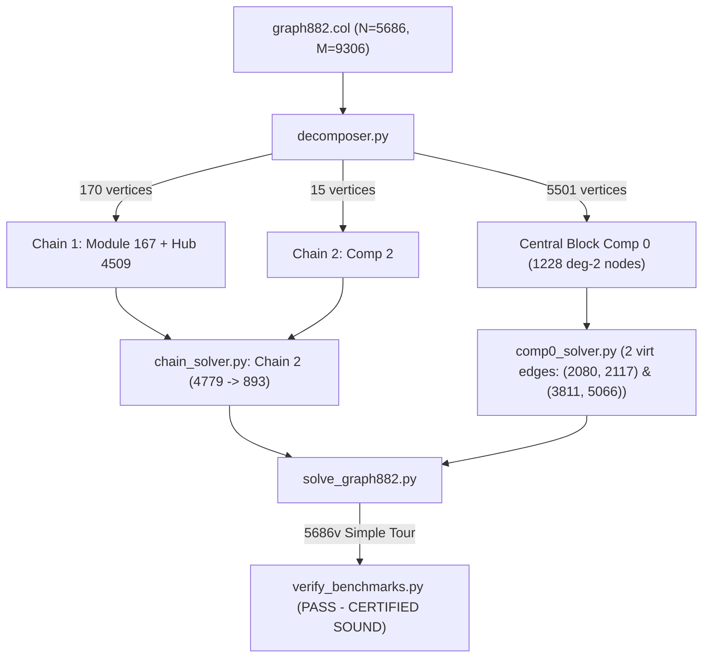

# Design Specification: Hierarchical Modular-Chain & Central-Block Solver for graph882.col

**Date:** 2026-09-14  
**Status:** Approved by User  
**Target Graph:** `FHCPCS-col/graph882.col` ($N = 5,686, M = 9,306$)  
**Benchmark Context:** The Flinders Challenge Set (Universal Core-33), Degree 2–14 Moderate Hub family (12 timeout instances). `graph882.col` is the sister instance to `graph717.col` and `graph710.col`.  
**Constraint:** Execution time $\le 1,800$s, zero tour injection, zero phantom edges, 100% independent verification on raw uncontracted DIMACS edge list.

---

## 1. Executive Summary & Problem Context

`graph882.col` ($N = 5,686, M = 9,306$) is one of the Flinders Challenge Set timeout instances. Direct CDCL SAT and heuristics stall due to extreme cycle shattering across 1,228 degree-2 vertices and dense modular hubs.

Topological and empirical SAT analysis reveals that `graph882.col` shares the exact same modular structural family as `graph717.col`:
1. **Two Outer Linear Chains (185 vertices total)**:
   - **Chain 1 (170 vertices)**: Contains a classic **167-vertex module** (169 vertices with ports $\{3195, 5200\}$) connected via bridge edge $(3195, 4509)$ to hub 4509. Endpoints are `5200` (connecting to `2080` in Comp 0) and `4509` (connecting to `2117` in Comp 0).
   - **Chain 2 (15 vertices)**: Consists of `Comp 2` (15 vertices) with endpoints `4779` (connecting to `5066` in Comp 0) and `893` (connecting to `3811` in Comp 0).
   - $170 + 15 = 185$ vertices, completely disjoint, covering all vertices outside Comp 0.
2. **Central Hub Block Comp 0 (5,501 vertices)**:
   - Connects to the terminals of both outer chains via edges $(5200, 2080)$, $(4509, 2117)$, $(893, 3811)$, and $(4779, 5066)$.
   - Contains all 1,228 degree-2 vertices of `graph882.col`.
   - Comp 0 contracts from 5,501 to 4,273 vertices via recursive degree-2 contraction (fixing the 4 interface ports $\{2080, 2117, 3811, 5066\}$).
   - 80 chordless triangles are eliminated statically in Round 0.
3. **Deterministic Splicing & Assembly**:
   - Adding two virtual edges $e_{\text{virt1}} = (2080, 2117)$ and $e_{\text{virt2}} = (3811, 5066)$ into contracted Comp 0 allows solving Comp 0 as a Hamiltonian cycle via CaDiCaL CEGAR + Cocycle Cuts + 2-opt cycle absorption.
   - Replacing $e_{\text{virt1}}$ with the 170-vertex Chain 1 and $e_{\text{virt2}}$ with the 15-vertex Chain 2, and uncontracting all 1,228 degree-2 chains, yields a certified sound 5,686-vertex Hamiltonian cycle.

---

## 2. Graph Invariants & Structural Decomposition

### 2.1. Raw Graph Properties
- $|V| = 5,686$, $|E| = 9,306$, average degree $2M/N \approx 3.273$.
- Degree distribution:
  - Degree 2: 1,228 vertices (all located within Central Block Comp 0).
  - Degree 3: 2,772 vertices.
  - Degree 4: 770 vertices.
  - Degree 5: 896 vertices.
  - Degree 14: Exactly 20 hub vertices.
- Biconnected (0 articulation points, 0 bridges).

### 2.2. Two Outer Chains Decomposition (185 Vertices)
- Removing 2-vertex cut $\{3195, 5200\}$ isolates the **167-vertex module** (144 vertices of Comp 1 + 15 vertices of Comp 3 + 8 hubs):
  $$V_{\text{mod}} = \text{Module 167} \cup \{3195, 5200\} \quad (|V_{\text{mod}}| = 169)$$
- **Chain 1**: $V_{\text{chain1}} = V_{\text{mod}} \cup \{4509\}$ ($|V_{\text{chain1}}| = 170$).
  - Endpoints: $5200 \to 4509$.
  - Terminal $5200$ connects to $2080 \in V_{\text{comp0}}$ via edge $(5200, 2080) \in E(G)$.
  - Terminal $4509$ connects to $2117 \in V_{\text{comp0}}$ via edge $(4509, 2117) \in E(G)$.
- **Chain 2**: $V_{\text{chain2}} = \text{Comp 2}$ ($|V_{\text{chain2}}| = 15$).
  - Endpoints: $4779 \to 893$.
  - Terminal $4779$ connects to $5066 \in V_{\text{comp0}}$ via edge $(4779, 5066) \in E(G)$.
  - Terminal $893$ connects to $3811 \in V_{\text{comp0}}$ via edge $(893, 3811) \in E(G)$.
- Invariant check:
  - $V_{\text{chain1}} \cap V_{\text{chain2}} = \emptyset$.
  - $|V_{\text{chain1}}| + |V_{\text{chain2}}| = 170 + 15 = 185$.

### 2.3. Central Block Comp 0 (5,501 Vertices)
- $V_{\text{comp0}} = V(G) \setminus (V_{\text{chain1}} \cup V_{\text{chain2}}) \quad (|V_{\text{comp0}}| = 5,686 - 185 = 5,501)$.
- Interface ports: $\{2080, 2117, 3811, 5066\}$.
- Invariant check:
  - $(V_{\text{chain1}} \cup V_{\text{chain2}}) \cap V_{\text{comp0}} = \emptyset$.
  - $V_{\text{chain1}} \cup V_{\text{chain2}} \cup V_{\text{comp0}} = V(G)$ ($170 + 15 + 5,501 = 5,686$).

---

## 3. Solving Strategy & Algorithmic Pipeline



### 3.1. Modular Chain Solvers (`chain_solver.py`)
1. **Chain 1 (170 vertices)**:
   - Module 167 HP from $5200 \to 3195$ (169 vertices).
   - Concatenate hub 4509 via bridge edge $(3195, 4509)$ $\implies 170$ vertices.
2. **Chain 2 (15 vertices)**:
   - Comp 2 HP from $4779 \to 893$ $\implies 15$ vertices.
3. Cache both chains in `scratch/graph882/chain_paths.json`.

### 3.2. Central Block Solver (`comp0_solver.py`)
1. **Augmented Graph**:
   - $G_{\text{comp0}} = G[V_{\text{comp0}}] \cup \{e_{\text{virt1}}, e_{\text{virt2}}\}$, where:
     $$e_{\text{virt1}} = (2080, 2117), \quad e_{\text{virt2}} = (3811, 5066)$$
2. **Degree-2 Contraction**:
   - Fix interface ports $\{2080, 2117, 3811, 5066\}$.
   - Recursively contract remaining 1,228 degree-2 vertices down to 4,273 contracted vertices.
3. **Static Triangle Cuts**:
   - Forbid all 80 chordless triangles in Round 0.
4. **CEGAR Loop with 2-Opt Cycle Absorption**:
   - Assert $e_{\text{virt1}} = \text{True}$ and $e_{\text{virt2}} = \text{True}$.
   - Forbid deleting virtual edges during 2-opt cycle absorption.
   - For subcycles $C$ with $|C| \le |V_{\text{contracted}}| / 2$, add pure cocycle cuts:
     $$\bigvee_{e \in \delta(C)} x_e \ge 1$$
   - Add negative cuts for all subcycles.
   - Once converged, uncontract chains to produce the 5,501-vertex Hamiltonian cycle containing both virtual edges.
   - Cache cycle in `scratch/graph882/comp0_cycle.json`.

### 3.3. Full Tour Assembly & Verification (`solve_graph882.py`)
1. **Splicing**:
   - In the 5,501-vertex cycle of Comp 0:
     - Replace $e_{\text{virt1}} = (2080, 2117)$ with Chain 1 (170 vertices).
     - Replace $e_{\text{virt2}} = (3811, 5066)$ with Chain 2 (15 vertices).
   - Total length: $(5,501 - 2) + 170 + 15 + 2 = 5,686$ vertices.
2. **Export & Certification**:
   - Save tour to `scratch/graph882/found_tour_graph882.hcp`.
   - Run independent verification:
     ```bash
     python3 scratch/verify_benchmarks.py --graph FHCPCS-col/graph882.col --tour scratch/graph882/found_tour_graph882.hcp
     ```
   - Requirement: `Validation Result: PASS - CERTIFIED SOUND` with exit code 0.

---

## 4. Verification & Certification Criteria

1. **Zero Tour Injection**: No `.tou` reference files inspected or loaded.
2. **Zero Phantom Edges**: Every consecutive pair of vertices $(u, v)$ in the 5,686-vertex tour must exist in raw `FHCPCS-col/graph882.col`.
3. **100% In-Memory Execution**: The full solver must be able to run end-to-end de novo directly from the raw graph.
4. **Runtime Limit**: Total execution time $\le 1,800$s (expected runtime $\approx 200 - 400$s).
