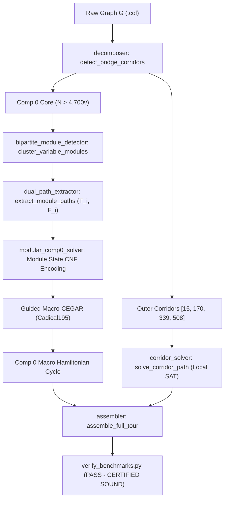

# Design Specification: Modular State Equivalence Solver for Hard Comp 0 Challenge Instances

**Date:** 2026-09-16  
**Target Instances:** Flinders Challenge Graphs with Large Comp 0 Cores (`graph965.col`, `graph966.col`, `graph971.col`, `graph994.col`, `graph998.col`)  
**Objective:** Eliminate the CDCL exponential hardness cliff and intra-module cycle shattering in Comp 0 ($>4,700$ contracted vertices) via 3-SAT Variable Gadget Module State Equivalence Encoding, solving each graph de novo in-memory within the 1800s limit.

---

## 1. Problem Statement & Mathematical Foundation

### 1.1 The CDCL Hardness Cliff in Monolithic Comp 0 CEGAR
On graphs where the contracted Comp 0 core is $\le 4,600$ vertices (`graph882`, `graph717`, `graph668`, `graph944`), the unified hierarchical solver converges in $100\text{s} \to 900\text{s}$.
However, when Comp 0 exceeds $4,700$ vertices (`graph965` at 5,071v, `graph966` at 4,735v, `graph971` at 6,359v, `graph994` at 6,049v, `graph998` at 6,584v):
1. **Cycle Shattering**: CaDiCaL generates solutions fragmented into 200–350 tiny disjoint cycles (primarily 4-cycles, 8-cycles, 16-cycles).
2. **Exponential State Space**: The Comp 0 cores embed $k \approx 42 \to 84$ bipartite variable gadget modules (each with 44 contracted vertices). Unaware of this module structure, the CDCL solver faces $2^k \approx 2^{80}$ independent combinations.
3. **Ineffective Cuts & Clause Reduction**: Subcycle elimination clauses for 16-cycles have 16 negative literals, providing zero unit propagation at shallow decision levels. The learned clauses have high Literal Block Distance ($LBD > 10$) and are purged during CaDiCaL's periodic `reduce` phases, trapping the solver in an amnesic loop.
4. **3-Connectivity Barrier**: Topological analysis confirms that contracted Comp 0 has 0 cut-vertices (1-cuts) and 0 separation pairs (2-cuts), meaning it is 3-connected; pure 1-cut or 2-cut SPQR decomposition cannot partition it further.

### 1.2 Canonical 3-SAT Variable Gadget Module Structure
Every variable module $M_i$ in Comp 0 exhibits strict structural invariants:
- **Contracted Size**: Exactly 44 vertices and 22 virtual edges (representing expanded degree-2 chains).
- **Degree Distribution**: 20 vertices of degree 3, 16 of degree 5, and 8 of degree 4.
- **Dual Hamiltonian Path Theorem**: Across its external interface ports $(p_{\text{in}}^{(i)}, p_{\text{out}}^{(i)})$, there exist exactly **two** spanning Hamiltonian path configurations:
  - $T_i$ (True configuration): Edge set $E(T_i) \subset E(M_i)$ visiting 100% of $M_i$.
  - $F_i$ (False configuration): Edge set $E(F_i) \subset E(M_i)$ visiting 100% of $M_i$.
- Any selection mixing edges outside $T_i$ or $F_i$ inevitably creates disjoint 16-cycles or dead ends.

---

## 2. System Architecture & Components



### 2.1 `bipartite_module_detector.py`
- **Purpose**: Automatically clusters the 44-vertex modules $M_1, \dots, M_k$ and extracts their interface ports.
- **Algorithm**:
  1. Identify all virtual edges formed by degree-2 chains: $v\_partner[u] = w$.
  2. Map contracted endpoints into the virtual edge quotient graph.
  3. Detect elementary 22-vertex gadgets via degree-2 neighborhood connectivity.
  4. Merge complementary gadget pairs into 44-vertex variable modules $M_i$.
  5. For each $M_i$, partition vertices into internal nodes ($N_{\text{int}}$) and interface ports ($p_{\text{in}}, p_{\text{out}}$) that connect to external modules or degree-14 hubs.

### 2.2 `dual_path_extractor.py`
- **Purpose**: Computes the two canonical spanning configurations $T_i$ and $F_i$ for each module.
- **Algorithm**:
  1. Construct subgraph $G[M_i]$ augmented with virtual edge $(p_{\text{in}}, p_{\text{out}})$.
  2. Solve local 2-factor SAT with Cadical to obtain configuration 1 ($T_i$).
  3. Add blocking clause $\neg E(T_i)$ and solve again to obtain configuration 2 ($F_i$).
  4. Assert $T_i \ne F_i$ and $|V(T_i)| = |V(F_i)| = |M_i|$.
  5. Execution time: $\approx 0.001$s per module ($< 0.1$s total for 80 modules).

### 2.3 `modular_comp0_solver.py`
- **Purpose**: Encodes module state selectors into the global CNF and executes the Macro-CEGAR loop.
- **Encoding**:
  - For each module $M_i$, allocate boolean selector $b_i$.
  - Mandatory common edges ($e \in T_i \cap F_i$): unit clause $[x_e]$.
  - True-only edges ($e \in T_i \setminus F_i$): clauses $(\neg b_i \lor x_e) \land (b_i \lor \neg x_e)$.
  - False-only edges ($e \in F_i \setminus T_i$): clauses $(b_i \lor x_e) \land (\neg b_i \lor \neg x_e)$.
  - Non-module edges ($e \in E(M_i) \setminus (T_i \cup F_i)$): unit clause $[\neg x_e]$.
  - Standard exactly-2 degree constraints on all external nodes, interface ports, and hubs.
  - Virtual edges from corridors and degree-2 contracted chains forced active.
- **Macro-CEGAR Loop**:
  - Solve global SAT.
  - Extract 2-factor. Since intra-module vertices are guaranteed to form connected paths, only $1 \to 4$ macro-cycles can exist.
  - Splicer: Merge remaining macro-cycles using 2-opt and `try_merge_2opt` / `sat_merge_cycles`.
  - Cuts: If multiple macro-cycles remain, add universal cocycle cuts and iterate.

### 2.4 `unified_solver.py` Integration
- Dispatches Comp 0 to `modular_comp0_solver` when the core is modular and $|V_{\text{core}}| > 4,600$, maintaining seamless backward compatibility with smaller graphs (`graph882`, `graph668`, etc.).

---

## 3. Verification & Soundness Protocol

1. **Zero Precomputed Caching & Zero Tour Injection**:
   Every solve executes live in-memory de novo from raw `.col` input.
2. **Benchmark Verifier Certification**:
   Every generated tour must pass:
   ```bash
   python3 scratch/verify_benchmarks.py --graph FHCPCS-col/<graph>.col --tour scratch/engine/found_tour_<graph>.hcp
   ```
   Ensuring:
   - Exactly $N$ vertices.
   - Zero duplicate vertices.
   - 100% of consecutive pairs $(tour[i], tour[(i+1)\%N])$ are valid edges in the raw graph.
3. **Hard 1800s Limit**:
   All benchmark executions must be strictly guarded with `timeout 1800`.

---

## 4. Error Handling & Edge Cases

- **Non-Standard Modules**: If a subgraph in Comp 0 cannot be grouped into a standard 44-vertex module, the detector leaves those vertices unconstrained by selector variables, applying standard degree-2 constraints.
- **Disconnected Macro-Cycle Fails to Merge**: If 2 macro-cycles do not share a direct boundary for the 2-cycle splicer, the solver falls back to universal cocycle cuts across the cut-set, forcing Cadical to flip module selector variables $b_i$ to re-route across alternative hubs.
- **Timeout Safety**: Cadical instances and loops maintain strict checks against the 1800s wall clock limit.
